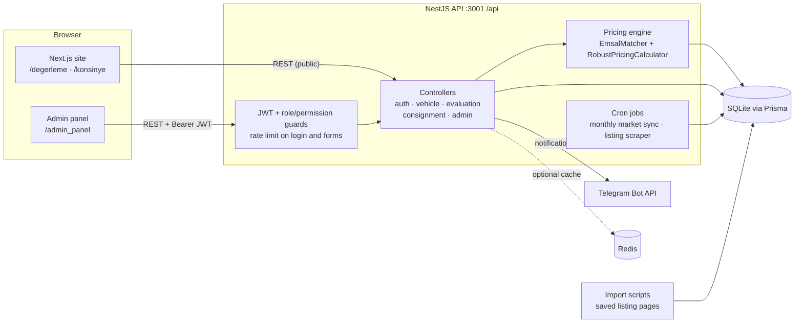
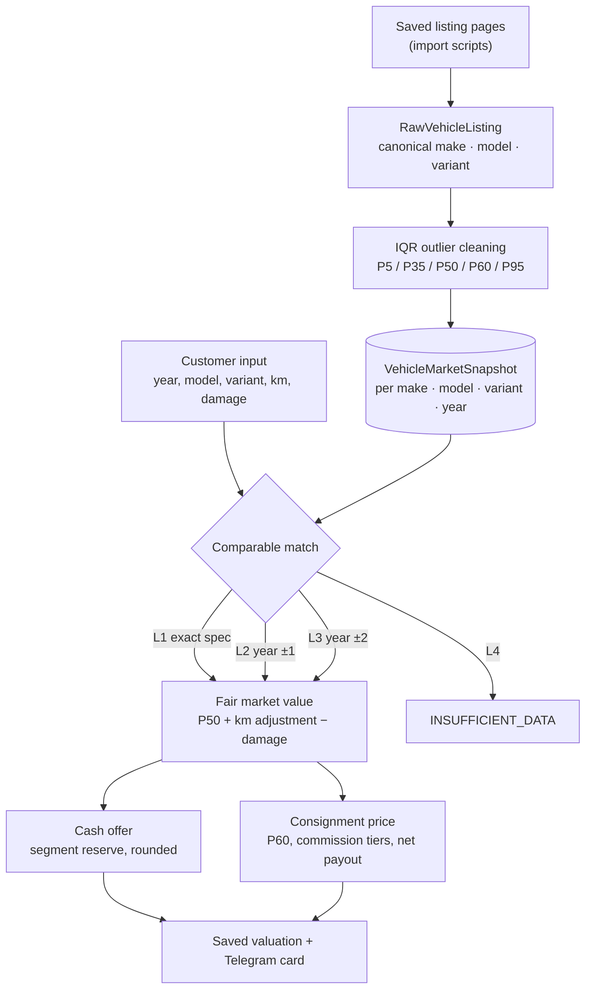

<p align="center">
  
</p>

# NakitGaraj: Used-Car Valuation & Consignment Platform

**Prices a used car from comparable market listings and turns that price into an instant cash offer and a consignment listing price. Includes an admin panel/CRM for the dealer's team.**

[](https://github.com/CoskunerBerke/NakitGaraj/actions/workflows/ci.yml)


<table>
  <tr>
    <td width="50%"></td>
    <td width="50%"></td>
  </tr>
  <tr>
    <td align="center"><sub>Valuation wizard: the catalogue narrows the choices step by step</sub></td>
    <td align="center"><sub>Result: cash offer and consignment price computed by the pricing engine</sub></td>
  </tr>
</table>

<sub>All screenshots come from a local run with fictional demo data (<code>npm run seed:demo</code> plus test entries such as "Deniz Örnek, 05550000000"). The prices are synthetic, not real market data. Brand logos are missing because their CDN was not reachable from the screenshot environment.</sub>

> **Status:** work in progress, not in commercial use. The valuation flow, consignment flow, admin panel and pricing engine work end to end (see [Testing](#testing)). Some parts are still prototypes; see [Status & roadmap](#status--roadmap).

## Overview

NakitGaraj ("cash garage") is built for a used-car dealer that offers two ways to sell: **sell the car to the dealer for cash now**, or **leave it on consignment** and let the dealer sell it. The customer picks make → model year → model → engine → trim, enters mileage, damage and equipment, and gets both offers in seconds. Priced valuations and all applications are stored for the admin panel and can also be sent to a Telegram group as an image card with WhatsApp shortcuts.

Prices come from real market statistics instead of a fixed depreciation formula. Saved listing pages are normalised into canonical make/model/variant names. Outliers are removed with IQR, and each make · model · variant · year group becomes a market snapshot with P5–P95 percentiles, median mileage and a mileage slope. A valuation matches the closest snapshot (four levels, from exact spec down to "not enough data"). It then applies mileage and damage adjustments, a cash reserve that depends on the price segment, and tiered consignment commissions.

## Features

**Customer site (Next.js)**
- Valuation wizard (`/degerleme`): cascading catalogue selects, mileage, damage record, 13-part paint/replacement map, equipment checklist, desired price.
- Result page with the instant cash offer, the consignment listing price and explanation notes (match level, comparable count, mileage adjustment).
- Consignment application (`/konsinye`), opened from a valuation or on its own, with React Hook Form + Zod validation. Customers can also request a vehicle that is missing from the catalogue.
- Turkish/English UI switch, light/dark theme, responsive layout.

**Admin panel (`/admin_panel`)**
- Dashboard (totals, pending applications, average valuation, catalogue size), valuations, consignment CRM with status updates, vehicle requests.
- Staff accounts with roles (ADMIN, CRM_MANAGER, custom). Permissions are checked on the server for every admin route.
- Audit log, CSV / Excel / JSON catalogue import, Telegram notification settings, market-sync settings.

**Backend (NestJS REST API under `/api`)**
- Pricing engine: comparable matcher (`emsal-matcher.service.ts`), robust calculator (`robust-pricing-calculator.ts`), canonical name normaliser; suspicious listings are quarantined during import.
- JWT authentication, role and permission guards, request validation (class-validator, whitelist), rate limiting on login (5/min) and on the public forms.
- Telegram notifications with a generated image card (`@napi-rs/canvas`).
- Scheduled jobs: monthly market-price sync and a listing scraper (Playwright, optional proxies).
- Optional Redis cache with an in-memory fallback.

## Screenshots

| Admin dashboard | Valuation list (CRM) |
|---|---|
|  |  |

<p align="center">
  <br />
  <sub>Mobile layout (390 × 844). Fictional demo data.</sub>
</p>

## Architecture



### How a price is calculated



Level 2 and 3 matches combine several snapshots and normalise them to the requested model year (the yearly price change is learned from the snapshots when there are enough of them, otherwise 8 % is used). Cars under 400,000 TL whose cash offer would be below 85 % of market value get a "manual evaluation" answer instead of an automatic offer.

## Tech stack

| Layer | Tools |
|---|---|
| Frontend | Next.js 16 (App Router), React 19, TypeScript, Tailwind CSS 4, Framer Motion, TanStack Query, React Hook Form, Zod, Lucide icons |
| Backend | NestJS 11, Prisma 5, @nestjs/jwt, bcrypt, @nestjs/throttler, @nestjs/schedule, class-validator, Playwright, Cheerio, jsdom, xlsx, csv-parser, @napi-rs/canvas |
| Data | SQLite (`backend/prisma/dev.db`), optional Redis cache |
| Tests & CI | Jest (unit + e2e with Supertest), GitHub Actions |
| Ops | PM2 (`ecosystem.config.js`), Nginx + Certbot ([DEPLOYMENT.md](DEPLOYMENT.md)) |

## Project structure

```text
NakitGaraj/
├── frontend/                   # Next.js customer site + admin panel
│   └── src/
│       ├── app/                # /, /degerleme, /konsinye, /admin_panel/...
│       ├── components/         # navbar, footer, damage schematic, animated UI
│       ├── context/            # language + theme providers
│       └── config/api.ts       # API base URL (NEXT_PUBLIC_API_URL)
├── backend/                    # NestJS API
│   ├── prisma/                 # schema, migrations, seed.ts, seed-demo.ts
│   ├── src/
│   │   ├── evaluation/         # pricing engine, comparable matcher, normaliser
│   │   ├── vehicle/            # catalogue endpoints, monthly market sync
│   │   ├── consignment/ admin/ auth/ audit/ import/ telegram/ scraper/
│   │   └── scripts/            # one-off data import / cleanup scripts
│   └── test/                   # e2e tests
├── chrome-extension/           # listing import helper (prototype)
├── docs/screenshots/           # README images (demo data)
├── .github/workflows/ci.yml    # CI: typecheck, tests, seed smoke test, builds
├── docker-compose.yml          # optional Postgres + Redis containers (see notes)
├── ecosystem.config.js         # PM2: backend :3001, frontend :3000
├── run_project.bat             # Windows: prepare DB and start both apps
└── DEPLOYMENT.md               # VPS guide (Turkish): PM2, Nginx, SSL
```

## Quick start

Requires Node.js 20.19+ (20.x line), 22.13+ (22.x line) or 24+: jsdom 29, a backend dependency, supports only these versions (both `package.json` files declare the range in `engines`). CI uses Node 22. These steps were run on a fresh clone.

```bash
git clone https://github.com/CoskunerBerke/NakitGaraj.git
cd NakitGaraj/backend
npm ci
cp .env.example .env              # then set JWT_SECRET (e.g. openssl rand -hex 32)
npx prisma generate
npx prisma migrate deploy         # creates prisma/dev.db (SQLite) from the migrations
ADMIN_PASSWORD='choose-a-password' npx prisma db seed   # catalogue, roles, admin user
npm run seed:demo                 # optional: synthetic market data so valuations return prices
npm run start:dev                 # http://localhost:3001/api
```

In a second terminal:

```bash
cd NakitGaraj/frontend
npm ci
npm run dev                       # http://localhost:3000
```

Log in at <http://localhost:3000/admin_panel> with `ADMIN_EMAIL` (default `admin@nakitgaraj.com`) and the `ADMIN_PASSWORD` you used for the seed. Without `npm run seed:demo` (or your own imported listings), valuations answer "not enough market data", because the real listing data is not part of the repository. On Windows, `run_project.bat` creates the database with `prisma db push` instead, runs the seed and starts both apps.

## Configuration

Backend variables go in `backend/.env` (template: [`backend/.env.example`](backend/.env.example)). Frontend variables are read at build time.

| Variable | Where | Required | Purpose |
|---|---|---|---|
| `JWT_SECRET` | backend | **yes** | Signs admin sessions. The backend refuses to start without it, refuses placeholders such as `change-me` when `NODE_ENV=production`, and in every environment refuses the two JWT secrets that were once committed to this repository (they are public in the git history) with a "rotate your JWT_SECRET" error. |
| `NODE_ENV` | backend | on servers | `production` on servers (the PM2 config sets it). |
| `PORT` | backend | no | API port, default `3001`. |
| `CORS_ORIGIN` | backend | no | Comma-separated browser origins allowed to call the API from another site. Unset with `NODE_ENV=production`: no cross-origin requests at all (the site reaches the API on its own origin through Nginx `/api`). Unset in development: every origin is allowed. |
| `ADMIN_EMAIL` / `ADMIN_PASSWORD` | seed | password: **yes** | Admin account created or updated by `npx prisma db seed`. There is no default password. |
| `TELEGRAM_BOT_TOKEN`, `TELEGRAM_CHAT_IDS`, `GALLERY_WHATSAPP_PHONE` | backend | no | Initial Telegram settings (later editable in the admin panel). |
| `REDIS_URL` | backend | no | Redis cache, e.g. `redis://localhost:6379`. Falls back to memory. |
| `SCRAPER_PROXY` / `SCRAPER_PROXIES` | backend | no | Proxies for the listing scraper. |
| `LISTING_ARCHIVE_DIR` | backend, scripts | no | Local folder of saved listing pages used by the import scripts. |
| `NEXT_PUBLIC_API_URL` | frontend build | on servers | API base URL, e.g. `/api` behind Nginx. Default: `http://<host>:3001/api`. |
| `POSTGRES_USER` / `POSTGRES_PASSWORD` / `POSTGRES_DB` | root `.env` | for docker compose | Only for the optional containers in `docker-compose.yml`. |

## Testing

```bash
cd backend
npx prisma migrate deploy   # no-op if you followed the quick start
npm test                    # 10 suites: 51 passed, 2 skipped
npm run test:e2e            # 4 suites: 83 passed
```

The tests use `prisma/dev.db`. If that database was created with `prisma db push` (for example by `run_project.bat`), skip `migrate deploy`: Prisma refuses to apply migrations to a schema it did not create (error P3005), and the tests run on that database as they are.

- **Unit tests:** pricing calculator, comparable matching, name normaliser, env validation (including the refused leaked secrets), CORS defaults, consignment/admin/vehicle services (including the accepted model years) and Telegram message escaping. Two pricing regression tests need the scraped market database and only run with `PRICING_REAL_DATA_TESTS=1`.
- **e2e tests** (Supertest against the real Nest app) check all 23 admin routes: 401 without a token and with a token signed by another secret, 403 for a role without permissions, and 403 on the 7 ADMIN-only routes (user management, Telegram settings) for a role that has every permission but is not ADMIN. A test fails when a new admin route is missing from that list. Other e2e tests cover the login rate limit and the admin JSON import.
- **CI** ([`ci.yml`](.github/workflows/ci.yml)) runs on every push and pull request. Backend: typecheck, migrations, unit and e2e tests, seed + demo-seed smoke test, build. Frontend: typecheck, production build.

## Deployment

`ecosystem.config.js` runs the built backend (`npm run start:prod`) and frontend (`npm run start`) under PM2. [DEPLOYMENT.md](DEPLOYMENT.md) (Turkish) walks through a Linux VPS setup with PM2, Nginx and Let's Encrypt. On a server:

- set `JWT_SECRET` and (for seeding) `ADMIN_PASSWORD` in `backend/.env`; `ecosystem.config.js` contains no secrets;
- build the frontend with `NEXT_PUBLIC_API_URL=/api` so the browser reaches the API through Nginx over HTTPS on the same origin. In production the API refuses cross-origin requests unless `CORS_ORIGIN` lists the calling site, so a frontend built without `/api` (calling `:3001` directly) needs `CORS_ORIGIN`;
- keep port 3001 private; Nginx forwards `/api` and passes `X-Forwarded-For`, which the backend trusts only from localhost.

## Security notes

- No secrets in the current files. The backend has no fallback JWT secret and refuses placeholder secrets in production. Two JWT secrets from earlier versions are still visible in the git history; the backend refuses both in every environment, so a server that still uses one has to rotate it. A server first started with an older `ecosystem.config.js` keeps that secret in its PM2 environment, which overrides `backend/.env` and survives `pm2 restart`; [DEPLOYMENT.md](DEPLOYMENT.md) gives the commands that recreate the PM2 process. The seed has no default admin password.
- CORS fails closed in production: without `CORS_ORIGIN` the API answers no cross-origin browser requests.
- Admin routes need a valid JWT and are checked on the server: user management and Telegram settings are ADMIN-only; pricing, import and market sync need `manage_vehicles`.
- Login is limited to 5 attempts per minute per IP. Public form submissions are rate-limited.
- Public responses do not include other customers' data. Customer input is escaped in Telegram HTML messages.
- Report security issues privately to the maintainer instead of opening a public issue.

## Status & roadmap

Done and verified: valuation wizard, pricing engine, consignment flow, admin panel/CRM, roles and permissions, Telegram notifications, CI.

Still in progress / known gaps:
- **Market data:** real snapshots come from saved listing pages imported with local scripts (`backend/src/scripts`). That data is not in the repository; `seed:demo` generates synthetic data for trying the app.
- **Listing sources:** the scraper cron and the Chrome extension read third-party listing sites (sahibinden.com, arabam.com). Their terms of use have to be checked before this runs in production. The extension is a prototype and posts to an import endpoint that the backend does not implement yet.
- **Provider integrations:** the data-provider cards and API key field on the admin "API Ayarları" page are a UI mock-up; nothing is stored or called. The Telegram and market-sync settings on that page do work.
- **White-label:** `frontend/src/config/site-config.ts` defines brand settings from `NEXT_PUBLIC_*` variables, but the UI does not use it yet (the footer contact details are hard-coded).
- **Database:** SQLite only. `prisma/schema.prisma` hard-codes `file:./dev.db`, so `DATABASE_URL` and the Postgres container in `docker-compose.yml` are not used yet.
- **Code quality:** ESLint reports existing errors in both packages, so CI does not run lint yet. `backend/src/scripts` contains many one-off data scripts from development.

---

## Türkçe

**NakitGaraj**, ikinci el bir aracın fiyatını benzer piyasa ilanlarından (emsal) hesaplayan ve bu fiyatı **anında nakit alım teklifine** ve **konsinye satış fiyatına** çeviren bir platformdur. Galeri ekibi için yönetim paneli/CRM içerir.

<sub>Tüm ekran görüntüleri yerel bir kurulumda, tamamen hayali demo verisiyle alınmıştır (<code>npm run seed:demo</code> ve "Deniz Örnek, 05550000000" gibi test kayıtları). Fiyatlar sentetiktir, gerçek piyasa verisi değildir. Marka logoları görünmüyor, çünkü ekran görüntülerinin alındığı ortamdan logoların CDN'ine erişilemedi.</sub>

> **Durum:** geliştirme sürüyor, ticari kullanımda değil. Değerleme akışı, konsinye akışı, yönetim paneli ve fiyatlama motoru uçtan uca çalışıyor (bkz. *Testler*). Bazı bölümler henüz prototip (bkz. *Durum ve yol haritası*).

### Genel bakış

NakitGaraj ("nakit garaj"), araç sahiplerine iki satış yolu sunan bir ikinci el galerisi için geliştirildi: aracı **hemen nakit karşılığında galeriye satmak** ya da **konsinye bırakıp** galerinin satmasını beklemek. Müşteri marka → model yılı → model → motor → paket seçer; kilometre, hasar ve donanım bilgisini girer ve iki teklifi saniyeler içinde görür. Fiyatlanan değerlemeler ve tüm başvurular yönetim paneli için kaydedilir; ayrıca WhatsApp kısayollu görsel kart olarak bir Telegram grubuna da gönderilebilir.

Fiyatlar sabit bir amortisman formülünden değil, gerçek piyasa istatistiklerinden gelir. Kaydedilmiş ilan sayfaları kanonik marka/model/versiyon adlarına dönüştürülür. Aykırı değerler IQR ile temizlenir ve her marka · model · versiyon · yıl grubu, P5–P95 yüzdelikleri, medyan kilometre ve kilometre eğimi içeren bir piyasa snapshot'ı olur. Değerleme en yakın snapshot'ı bulur (tam spesifikasyon eşleşmesinden "yetersiz veri"ye kadar dört seviye). Ardından kilometre ve hasar düzeltmesi, fiyat segmentine göre değişen nakit rezervi ve kademeli konsinye komisyonu uygular.

### Özellikler

**Müşteri sitesi (Next.js)**
- Değerleme sihirbazı (`/degerleme`): adım adım daralan katalog seçimleri, kilometre, hasar kaydı, 13 parçalı boya/değişen şeması, donanım listesi, istenen fiyat.
- Sonuç ekranı: anında nakit teklif, konsinye ilan fiyatı ve açıklama notları (eşleşme seviyesi, emsal sayısı, kilometre düzeltmesi).
- Konsinye başvurusu (`/konsinye`): bir değerlemeden ya da doğrudan açılır, React Hook Form + Zod ile doğrulanır. Müşteriler katalogda olmayan bir araç için talep de bırakabilir.
- Türkçe/İngilizce arayüz, açık/koyu tema, mobil uyumlu tasarım.

**Yönetim paneli (`/admin_panel`)**
- Özet ekranı (toplamlar, bekleyen başvurular, ortalama değerleme, katalog büyüklüğü), değerlemeler, durum güncellemeli konsinye CRM'i, araç talepleri.
- Rollü çalışan hesapları (ADMIN, CRM_MANAGER, özel roller). İzinler her admin rotasında sunucuda kontrol edilir.
- İşlem kayıtları (audit log), CSV / Excel / JSON katalog aktarımı, Telegram bildirim ayarları, piyasa senkronizasyonu ayarları.

**Backend (`/api` altında NestJS REST API)**
- Fiyatlama motoru: emsal eşleştirici (`emsal-matcher.service.ts`), sağlam fiyat hesaplayıcı (`robust-pricing-calculator.ts`), kanonik ad normalleştirici; şüpheli ilanlar içe aktarma sırasında karantinaya alınır.
- JWT kimlik doğrulama, rol ve izin guard'ları, istek doğrulama (class-validator, whitelist), girişte (dakikada 5) ve herkese açık formlarda istek sınırı.
- Oluşturulan görsel kartla Telegram bildirimleri (`@napi-rs/canvas`).
- Zamanlanmış görevler: aylık piyasa fiyatı senkronizasyonu ve ilan tarayıcı (Playwright, isteğe bağlı proxy'ler).
- Bellek içi yedeği olan isteğe bağlı Redis önbelleği.

### Ekran görüntüleri

Yönetim paneli özeti, değerleme listesi (CRM) ve mobil görünüm (390 × 844) için yukarıdaki [Screenshots](#screenshots) bölümüne bakın. Hepsi hayali demo verisidir.

### Mimari

Yukarıdaki [Architecture](#architecture) ve [How a price is calculated](#how-a-price-is-calculated) diyagramları geçerlidir: Next.js sitesi ve yönetim paneli → NestJS REST API (`:3001`, `/api`; JWT ve rol/izin guard'ları, giriş ve formlarda istek sınırı) → fiyatlama motoru → Prisma → SQLite. Cron görevleri (aylık piyasa senkronizasyonu, ilan tarayıcı) ve içe aktarma betikleri de veritabanına yazar; bildirimler Telegram Bot API'ye gider, Redis önbelleği isteğe bağlıdır.

2. ve 3. seviye eşleşmeler birkaç snapshot'ı birleştirir ve istenen model yılına göre normalleştirir (yıllık fiyat değişimi yeterli snapshot varsa onlardan öğrenilir, yoksa %8 kullanılır). Fiyatı 400.000 TL'nin altında olup nakit teklifi piyasa değerinin %85'inin altında kalacak araçlara otomatik teklif yerine "manuel değerlendirme" yanıtı verilir.

### Teknolojiler

| Katman | Araçlar |
|---|---|
| Ön yüz | Next.js 16 (App Router), React 19, TypeScript, Tailwind CSS 4, Framer Motion, TanStack Query, React Hook Form, Zod, Lucide ikonları |
| Backend | NestJS 11, Prisma 5, @nestjs/jwt, bcrypt, @nestjs/throttler, @nestjs/schedule, class-validator, Playwright, Cheerio, jsdom, xlsx, csv-parser, @napi-rs/canvas |
| Veri | SQLite (`backend/prisma/dev.db`), isteğe bağlı Redis önbelleği |
| Test ve CI | Jest (birim + Supertest ile e2e), GitHub Actions |
| İşletim | PM2 (`ecosystem.config.js`), Nginx + Certbot ([DEPLOYMENT.md](DEPLOYMENT.md)) |

### Proje yapısı

```text
NakitGaraj/
├── frontend/                   # Next.js müşteri sitesi + yönetim paneli
│   └── src/
│       ├── app/                # /, /degerleme, /konsinye, /admin_panel/...
│       ├── components/         # menü, alt bilgi, hasar şeması, animasyonlu arayüz
│       ├── context/            # dil + tema sağlayıcıları
│       └── config/api.ts       # API adresi (NEXT_PUBLIC_API_URL)
├── backend/                    # NestJS API
│   ├── prisma/                 # şema, migration'lar, seed.ts, seed-demo.ts
│   ├── src/
│   │   ├── evaluation/         # fiyatlama motoru, emsal eşleştirici, ad normalleştirici
│   │   ├── vehicle/            # katalog uç noktaları, aylık piyasa senkronizasyonu
│   │   ├── consignment/ admin/ auth/ audit/ import/ telegram/ scraper/
│   │   └── scripts/            # tek seferlik veri aktarma / temizlik betikleri
│   └── test/                   # e2e testleri
├── chrome-extension/           # ilan aktarma yardımcısı (prototip)
├── docs/screenshots/           # README görselleri (demo verisi)
├── .github/workflows/ci.yml    # CI: tip kontrolü, testler, seed denemesi, derlemeler
├── docker-compose.yml          # isteğe bağlı Postgres + Redis container'ları (notlara bakın)
├── ecosystem.config.js         # PM2: backend :3001, frontend :3000
├── run_project.bat             # Windows: veritabanını hazırlar ve iki uygulamayı başlatır
└── DEPLOYMENT.md               # VPS kılavuzu (Türkçe): PM2, Nginx, SSL
```

### Kurulum

Node.js 20.19+ (20.x serisi), 22.13+ (22.x serisi) veya 24+ gerekir: backend bağımlılığı jsdom 29 yalnızca bu sürümleri destekler (iki `package.json` dosyası da bu aralığı `engines` alanında belirtir). CI Node 22 kullanır. Aşağıdaki adımlar temiz bir klonda çalıştırılarak doğrulandı.

```bash
git clone https://github.com/CoskunerBerke/NakitGaraj.git
cd NakitGaraj/backend
npm ci
cp .env.example .env              # ardından JWT_SECRET girin (örn. openssl rand -hex 32)
npx prisma generate
npx prisma migrate deploy         # prisma/dev.db (SQLite) migration'lardan oluşturulur
ADMIN_PASSWORD='bir-sifre-secin' npx prisma db seed   # katalog, roller, admin kullanıcı
npm run seed:demo                 # isteğe bağlı: değerlemelerin fiyat döndürmesi için sentetik piyasa verisi
npm run start:dev                 # http://localhost:3001/api
```

İkinci bir terminalde:

```bash
cd NakitGaraj/frontend
npm ci
npm run dev                       # http://localhost:3000
```

<http://localhost:3000/admin_panel> adresinden `ADMIN_EMAIL` (varsayılan `admin@nakitgaraj.com`) ve seed sırasında kullandığınız `ADMIN_PASSWORD` ile giriş yapın. Gerçek ilan verisi depoda olmadığından `npm run seed:demo` (veya kendi içe aktardığınız ilanlar) olmadan değerlemeler "yeterli piyasa verisi yok" yanıtı verir. Windows'ta `run_project.bat` veritabanını bunun yerine `prisma db push` ile oluşturur, seed'i çalıştırır ve iki uygulamayı başlatır.

### Yapılandırma

Backend değişkenleri `backend/.env` dosyasına yazılır (şablon: [`backend/.env.example`](backend/.env.example)). Ön yüz değişkenleri derleme sırasında okunur.

| Değişken | Nerede | Zorunlu | Amaç |
|---|---|---|---|
| `JWT_SECRET` | backend | **evet** | Yönetici oturumlarını imzalar. Backend bu değer olmadan başlamaz, `NODE_ENV=production` iken `change-me` gibi örnek değerleri reddeder ve daha önce bu depoya eklenmiş (git geçmişinde herkese açık) iki JWT anahtarını her ortamda "rotate your JWT_SECRET" hatasıyla reddeder. |
| `NODE_ENV` | backend | sunucularda | Sunucularda `production` (PM2 yapılandırması bunu ayarlar). |
| `PORT` | backend | hayır | API portu, varsayılan `3001`. |
| `CORS_ORIGIN` | backend | hayır | API'yi başka bir siteden çağırabilecek tarayıcı origin'leri, virgülle ayrılmış. `NODE_ENV=production` iken boşsa hiçbir cross-origin isteğe izin verilmez (site API'ye kendi alan adından, Nginx `/api` üzerinden ulaşır). Geliştirmede boşsa her origin'e izin verilir. |
| `ADMIN_EMAIL` / `ADMIN_PASSWORD` | seed | şifre: **evet** | `npx prisma db seed` ile oluşturulan veya güncellenen admin hesabı. Varsayılan şifre yoktur. |
| `TELEGRAM_BOT_TOKEN`, `TELEGRAM_CHAT_IDS`, `GALLERY_WHATSAPP_PHONE` | backend | hayır | Başlangıç Telegram ayarları (sonra yönetim panelinden değiştirilebilir). |
| `REDIS_URL` | backend | hayır | Redis önbelleği, örn. `redis://localhost:6379`. Yoksa bellek kullanılır. |
| `SCRAPER_PROXY` / `SCRAPER_PROXIES` | backend | hayır | İlan tarayıcı için proxy'ler. |
| `LISTING_ARCHIVE_DIR` | backend, betikler | hayır | İçe aktarma betiklerinin kullandığı, kaydedilmiş ilan sayfalarının bulunduğu yerel klasör. |
| `NEXT_PUBLIC_API_URL` | ön yüz derlemesi | sunucularda | API adresi, örn. Nginx arkasında `/api`. Varsayılan: `http://<host>:3001/api`. |
| `POSTGRES_USER` / `POSTGRES_PASSWORD` / `POSTGRES_DB` | kök dizindeki `.env` | docker compose için | Yalnızca `docker-compose.yml` içindeki isteğe bağlı container'lar için. |

### Testler

```bash
cd backend
npx prisma migrate deploy   # kurulum adımlarını izlediyseniz bir şey yapmaz
npm test                    # 10 test dosyası: 51 geçti, 2 atlandı
npm run test:e2e            # 4 test dosyası: 83 geçti
```

Testler `prisma/dev.db` veritabanını kullanır. Veritabanı `prisma db push` ile oluşturulduysa (örneğin `run_project.bat` ile) `migrate deploy` adımını atlayın: Prisma kendi oluşturmadığı bir şemaya migration uygulamaz (P3005 hatası); testler o veritabanında olduğu gibi çalışır.

- **Birim testleri:** fiyat hesaplayıcı, emsal eşleştirme, ad normalleştirici, ortam değişkeni doğrulaması (reddedilen sızmış anahtarlar dahil), CORS varsayılanları, konsinye/admin/araç servisleri (kabul edilen model yılları dahil) ve Telegram mesajlarındaki kaçış işlemi. Kazınmış piyasa veritabanı gerektiren 2 fiyatlama regresyon testi yalnızca `PRICING_REAL_DATA_TESTS=1` ile çalışır.
- **e2e testleri** (gerçek Nest uygulamasına karşı Supertest) 23 admin rotasının tamamını dener: token yokken ve başka bir anahtarla imzalanmış token'da 401, izni olmayan rolde 403; yalnızca ADMIN'e açık 7 rotada (çalışan yönetimi, Telegram ayarları) tüm izinlere sahip ama ADMIN olmayan rolde 403. Yeni bir admin rotası bu listeye eklenmezse test başarısız olur. Diğer e2e testleri giriş deneme sınırını ve admin JSON aktarımını doğrular.
- **CI** ([`ci.yml`](.github/workflows/ci.yml)) her push ve pull request'te çalışır. Backend: tip kontrolü, migration'lar, birim ve e2e testleri, seed + demo seed denemesi, derleme. Ön yüz: tip kontrolü, production derlemesi.

### Sunucuya kurulum

`ecosystem.config.js`, derlenmiş backend'i (`npm run start:prod`) ve ön yüzü (`npm run start`) PM2 ile çalıştırır. [DEPLOYMENT.md](DEPLOYMENT.md), PM2, Nginx ve Let's Encrypt ile bir Linux VPS kurulumunu adım adım anlatır. Sunucuda:

- `backend/.env` dosyasına `JWT_SECRET` ve (seed için) `ADMIN_PASSWORD` yazın; `ecosystem.config.js` gizli anahtar içermez;
- tarayıcının API'ye Nginx üzerinden, HTTPS ile ve aynı origin'den ulaşması için ön yüzü `NEXT_PUBLIC_API_URL=/api` ile derleyin. Production'da API, `CORS_ORIGIN` çağıran siteyi listelemedikçe cross-origin istekleri reddeder; bu yüzden `/api` olmadan derlenmiş (doğrudan `:3001`'i çağıran) bir ön yüz `CORS_ORIGIN` gerektirir;
- 3001 portunu dışarı açmayın; Nginx `/api` isteklerini iletir ve `X-Forwarded-For` başlığını ekler, backend bu başlığa yalnızca localhost'tan geldiğinde güvenir.

### Güvenlik notları

- Mevcut dosyalarda gizli anahtar yok. Backend'de yedek JWT anahtarı bulunmaz ve production'da örnek anahtarlar reddedilir. Önceki sürümlerden iki JWT anahtarı git geçmişinde hâlâ görünür; backend ikisini de her ortamda reddeder, bu yüzden hâlâ birini kullanan bir sunucu anahtarını değiştirmek zorundadır. Eski bir `ecosystem.config.js` ile başlatılmış bir sunucuda bu anahtar PM2 ortamında kalır, `backend/.env` içindeki değerin önüne geçer ve `pm2 restart` sonrasında da korunur; PM2 sürecini yeniden oluşturan komutlar [DEPLOYMENT.md](DEPLOYMENT.md) içinde. Seed'in varsayılan admin şifresi yoktur.
- Production'da CORS kapalı başlar: `CORS_ORIGIN` yoksa API hiçbir cross-origin tarayıcı isteğine yanıt vermez.
- Admin rotaları geçerli bir JWT ister ve sunucuda kontrol edilir: çalışan yönetimi ve Telegram ayarları yalnızca ADMIN'e açıktır; fiyat, aktarım ve piyasa senkronizasyonu `manage_vehicles` izni ister.
- Giriş denemeleri IP başına dakikada 5 ile sınırlıdır. Herkese açık form gönderimlerinde de istek sınırı vardır.
- Herkese açık yanıtlar başka müşterilerin verisini içermez. Müşteri girdileri Telegram HTML mesajlarında kaçışlanır (escape).
- Güvenlik açıklarını herkese açık bir issue açmak yerine doğrudan proje sahibine bildirin.

### Durum ve yol haritası

Tamamlanan ve doğrulanan: değerleme sihirbazı, fiyatlama motoru, konsinye akışı, yönetim paneli/CRM, roller ve izinler, Telegram bildirimleri, CI.

Devam eden işler / bilinen eksikler:
- **Piyasa verisi:** gerçek snapshot'lar, yerel betiklerle (`backend/src/scripts`) içe aktarılan kayıtlı ilan sayfalarından üretilir. Bu veri depoda yoktur; `seed:demo` uygulamayı denemek için sentetik veri üretir.
- **İlan kaynakları:** tarayıcı (cron) ve Chrome eklentisi üçüncü taraf ilan sitelerini (sahibinden.com, arabam.com) okur. Bu çalışma production'a alınmadan önce sitelerin kullanım koşulları kontrol edilmelidir. Eklenti prototiptir ve backend'in henüz sunmadığı bir içe aktarma adresine istek atar.
- **Sağlayıcı entegrasyonları:** yönetim panelindeki "API Ayarları" sayfasında yer alan veri sağlayıcı kartları ve API anahtarı alanı yalnızca arayüz taslağıdır; hiçbir şey kaydedilmez veya çağrılmaz. Aynı sayfadaki Telegram ve piyasa senkronizasyonu ayarları çalışır.
- **Beyaz etiket:** `frontend/src/config/site-config.ts` marka ayarlarını `NEXT_PUBLIC_*` değişkenlerinden tanımlar, ancak arayüz henüz bunu kullanmıyor (alt bilgideki iletişim bilgileri sabit yazılmıştır).
- **Veritabanı:** yalnızca SQLite. `prisma/schema.prisma` içinde `file:./dev.db` sabit yazılı olduğundan `DATABASE_URL` ve `docker-compose.yml` içindeki Postgres container'ı henüz kullanılmıyor.
- **Kod kalitesi:** iki pakette de mevcut ESLint hataları var, bu yüzden CI henüz lint çalıştırmıyor. `backend/src/scripts` geliştirme sürecinden kalma çok sayıda tek seferlik veri betiği içerir.

---

Built by [Berke Coşkuner](https://github.com/CoskunerBerke)
