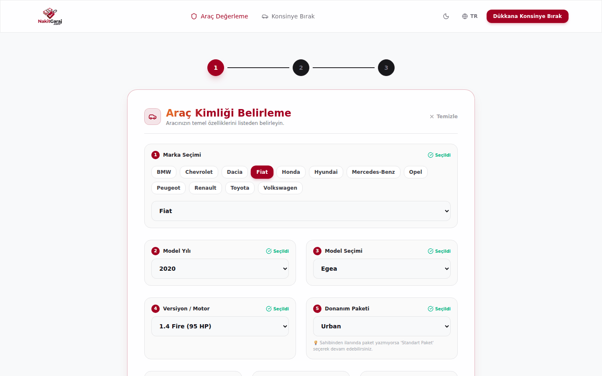
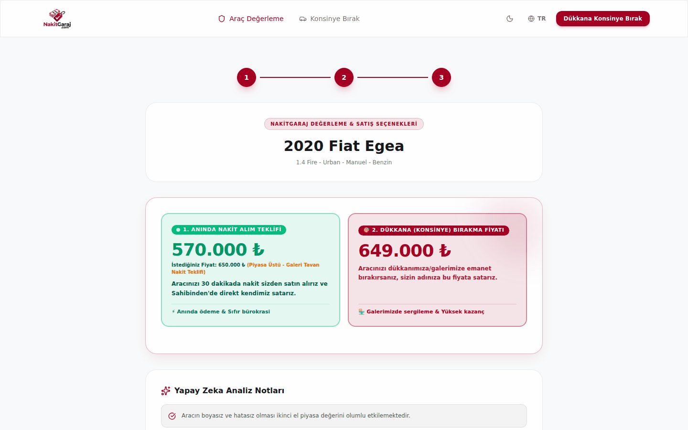
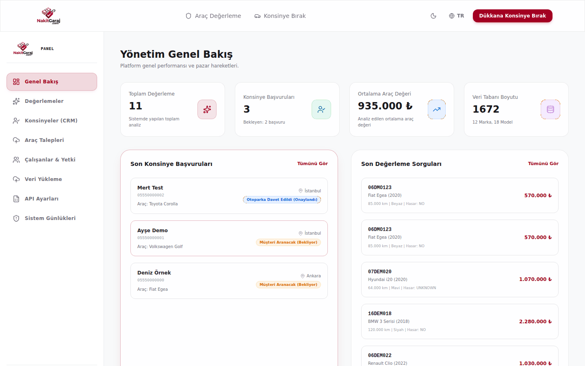
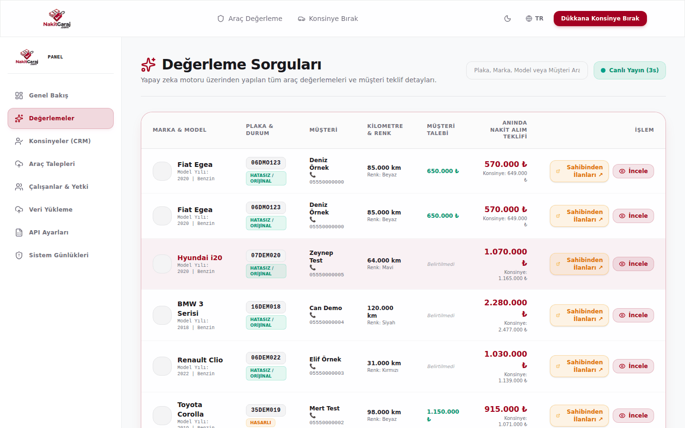
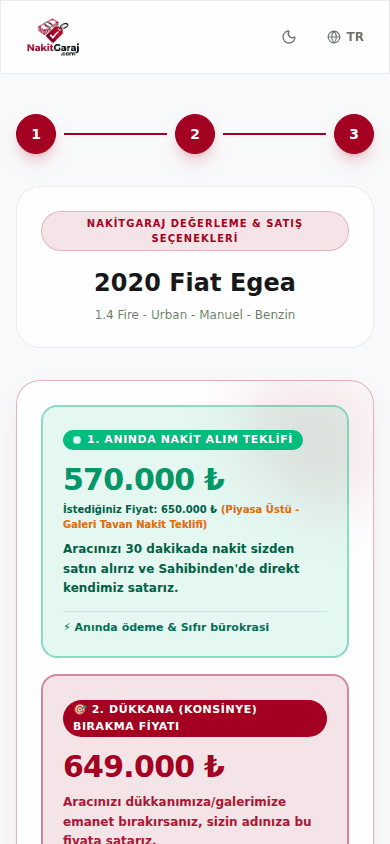
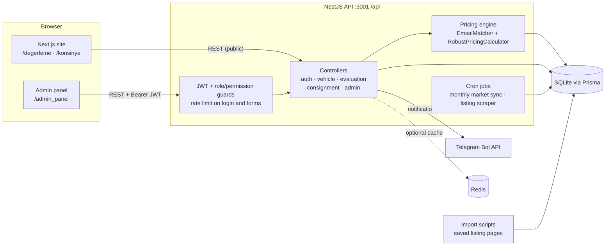
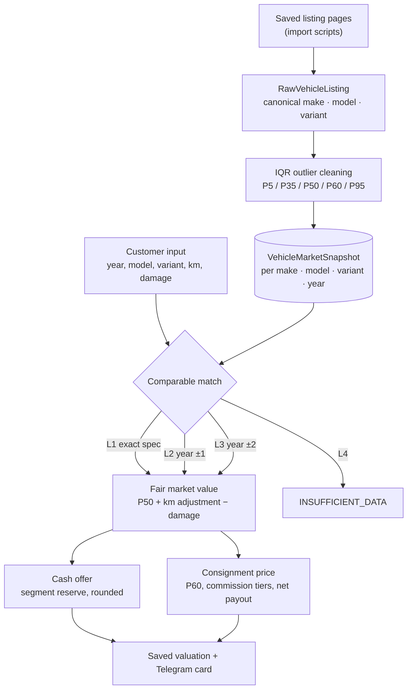

<p align="center">
  
</p>

# NakitGaraj: Used-Car Valuation & Consignment Platform

**Prices a used car from comparable market listings and turns that price into an instant cash offer and a consignment listing price. Includes an admin panel/CRM for the dealer's team.**

[](https://github.com/CoskunerBerke/NakitGaraj/actions/workflows/ci.yml)


<table>
  <tr>
    <td width="50%"></td>
    <td width="50%"></td>
  </tr>
  <tr>
    <td align="center"><sub>Valuation wizard: the catalogue narrows the choices step by step</sub></td>
    <td align="center"><sub>Result: cash offer and consignment price computed by the pricing engine</sub></td>
  </tr>
</table>

<sub>All screenshots come from a local run with fictional demo data (<code>npm run seed:demo</code> plus test entries such as "Deniz Örnek, 05550000000"). The prices are synthetic, not real market data. Brand logos are missing because their CDN was not reachable from the screenshot environment.</sub>

> **Status:** work in progress, not in commercial use. The valuation flow, consignment flow, admin panel and pricing engine work end to end (see [Testing](#testing)). Some parts are still prototypes; see [Status & roadmap](#status--roadmap).

## Overview

NakitGaraj ("cash garage") is built for a used-car dealer that offers two ways to sell: **sell the car to the dealer for cash now**, or **leave it on consignment** and let the dealer sell it. The customer picks make → model year → model → engine → trim, enters mileage, damage and equipment, and gets both offers in seconds. Priced valuations and all applications are stored for the admin panel and can also be sent to a Telegram group as an image card with WhatsApp shortcuts.

Prices come from real market statistics instead of a fixed depreciation formula. Saved listing pages are normalised into canonical make/model/variant names. Outliers are removed with IQR, and each make · model · variant · year group becomes a market snapshot with P5–P95 percentiles, median mileage and a mileage slope. A valuation matches the closest snapshot (four levels, from exact spec down to "not enough data"). It then applies mileage and damage adjustments, a cash reserve that depends on the price segment, and tiered consignment commissions.

## Features

**Customer site (Next.js)**
- Valuation wizard (`/degerleme`): cascading catalogue selects, mileage, damage record, 13-part paint/replacement map, equipment checklist, desired price.
- Result page with the instant cash offer, the consignment listing price and explanation notes (match level, comparable count, mileage adjustment).
- Consignment application (`/konsinye`), opened from a valuation or on its own, with React Hook Form + Zod validation. Customers can also request a vehicle that is missing from the catalogue.
- Turkish/English UI switch, light/dark theme, responsive layout.

**Admin panel (`/admin_panel`)**
- Dashboard (totals, pending applications, average valuation, catalogue size), valuations, consignment CRM with status updates, vehicle requests.
- Staff accounts with roles (ADMIN, CRM_MANAGER, custom). Permissions are checked on the server for every admin route.
- Audit log, CSV / Excel / JSON catalogue import, Telegram notification settings, market-sync settings.

**Backend (NestJS REST API under `/api`)**
- Pricing engine: comparable matcher (`emsal-matcher.service.ts`), robust calculator (`robust-pricing-calculator.ts`), canonical name normaliser; suspicious listings are quarantined during import.
- JWT authentication, role and permission guards, request validation (class-validator, whitelist), rate limiting on login (5/min) and on the public forms.
- Telegram notifications with a generated image card (`@napi-rs/canvas`).
- Scheduled jobs: monthly market-price sync and a listing scraper (Playwright, optional proxies).
- Optional Redis cache with an in-memory fallback.

## Screenshots

| Admin dashboard | Valuation list (CRM) |
|---|---|
|  |  |

<p align="center">
  <br />
  <sub>Mobile layout (390 × 844). Fictional demo data.</sub>
</p>

## Architecture



### How a price is calculated



Level 2 and 3 matches combine several snapshots and normalise them to the requested model year (the yearly price change is learned from the snapshots when there are enough of them, otherwise 8 % is used). Cars under 400,000 TL whose cash offer would be below 85 % of market value get a "manual evaluation" answer instead of an automatic offer.

## Tech stack

| Layer | Tools |
|---|---|
| Frontend | Next.js 16 (App Router), React 19, TypeScript, Tailwind CSS 4, Framer Motion, TanStack Query, React Hook Form, Zod, Lucide icons |
| Backend | NestJS 11, Prisma 5, @nestjs/jwt, bcrypt, @nestjs/throttler, @nestjs/schedule, class-validator, Playwright, Cheerio, jsdom, xlsx, csv-parser, @napi-rs/canvas |
| Data | SQLite (`backend/prisma/dev.db`), optional Redis cache |
| Tests & CI | Jest (unit + e2e with Supertest), GitHub Actions |
| Ops | PM2 (`ecosystem.config.js`), Nginx + Certbot ([DEPLOYMENT.md](DEPLOYMENT.md)) |

## Project structure

```text
NakitGaraj/
├── frontend/                   # Next.js customer site + admin panel
│   └── src/
│       ├── app/                # /, /degerleme, /konsinye, /admin_panel/...
│       ├── components/         # navbar, footer, damage schematic, animated UI
│       ├── context/            # language + theme providers
│       └── config/api.ts       # API base URL (NEXT_PUBLIC_API_URL)
├── backend/                    # NestJS API
│   ├── prisma/                 # schema, migrations, seed.ts, seed-demo.ts
│   ├── src/
│   │   ├── evaluation/         # pricing engine, comparable matcher, normaliser
│   │   ├── vehicle/            # catalogue endpoints, monthly market sync
│   │   ├── consignment/ admin/ auth/ audit/ import/ telegram/ scraper/
│   │   └── scripts/            # one-off data import / cleanup scripts
│   └── test/                   # e2e tests
├── chrome-extension/           # listing import helper (prototype)
├── docs/screenshots/           # README images (demo data)
├── .github/workflows/ci.yml    # CI: typecheck, tests, seed smoke test, builds
├── docker-compose.yml          # optional Postgres + Redis containers (see notes)
├── ecosystem.config.js         # PM2: backend :3001, frontend :3000
├── run_project.bat             # Windows: prepare DB and start both apps
└── DEPLOYMENT.md               # VPS guide (Turkish): PM2, Nginx, SSL
```

## Quick start

Requires Node.js 20.12+ (CI uses Node 22). These steps were run on a fresh clone.

```bash
git clone https://github.com/CoskunerBerke/NakitGaraj.git
cd NakitGaraj/backend
npm ci
cp .env.example .env              # then set JWT_SECRET (e.g. openssl rand -hex 32)
npx prisma generate
npx prisma db push                # creates prisma/dev.db (SQLite)
ADMIN_PASSWORD='choose-a-password' npx prisma db seed   # catalogue, roles, admin user
npm run seed:demo                 # optional: synthetic market data so valuations return prices
npm run start:dev                 # http://localhost:3001/api
```

In a second terminal:

```bash
cd NakitGaraj/frontend
npm ci
npm run dev                       # http://localhost:3000
```

Log in at <http://localhost:3000/admin_panel> with `ADMIN_EMAIL` (default `admin@nakitgaraj.com`) and the `ADMIN_PASSWORD` you used for the seed. Without `npm run seed:demo` (or your own imported listings), valuations answer "not enough market data", because the real listing data is not part of the repository. On Windows, `run_project.bat` runs `db push` + seed and starts both apps.

## Configuration

Backend variables go in `backend/.env` (template: [`backend/.env.example`](backend/.env.example)). Frontend variables are read at build time.

| Variable | Where | Required | Purpose |
|---|---|---|---|
| `JWT_SECRET` | backend | **yes** | Signs admin sessions. The backend refuses to start without it, and refuses placeholders such as `change-me` when `NODE_ENV=production`. |
| `NODE_ENV` | backend | on servers | `production` on servers (the PM2 config sets it). |
| `PORT` | backend | no | API port, default `3001`. |
| `CORS_ORIGIN` | backend | on servers | Comma-separated browser origins allowed to call the API. Unset allows every origin (local development only). |
| `ADMIN_EMAIL` / `ADMIN_PASSWORD` | seed | password: **yes** | Admin account created or updated by `npx prisma db seed`. There is no default password. |
| `TELEGRAM_BOT_TOKEN`, `TELEGRAM_CHAT_IDS`, `GALLERY_WHATSAPP_PHONE` | backend | no | Initial Telegram settings (later editable in the admin panel). |
| `REDIS_URL` | backend | no | Redis cache, e.g. `redis://localhost:6379`. Falls back to memory. |
| `SCRAPER_PROXY` / `SCRAPER_PROXIES` | backend | no | Proxies for the listing scraper. |
| `LISTING_ARCHIVE_DIR` | backend, scripts | no | Local folder of saved listing pages used by the import scripts. |
| `NEXT_PUBLIC_API_URL` | frontend build | on servers | API base URL, e.g. `/api` behind Nginx. Default: `http://<host>:3001/api`. |
| `POSTGRES_USER` / `POSTGRES_PASSWORD` / `POSTGRES_DB` | root `.env` | for docker compose | Only for the optional containers in `docker-compose.yml`. |

## Testing

```bash
cd backend
npx prisma migrate deploy   # tests use a migrated database (prisma/dev.db)
npm test                    # 9 suites: 34 passed, 2 skipped
npm run test:e2e            # 4 suites: 17 passed
```

- **Unit tests:** pricing calculator, comparable matching, name normaliser, env validation, consignment/admin/vehicle services and Telegram message escaping. Two pricing regression tests need the scraped market database and only run with `PRICING_REAL_DATA_TESTS=1`.
- **e2e tests** (Supertest against the real Nest app) cover authorization of every sensitive admin route (401 without a token, 403 for the wrong role), the login rate limit and the admin JSON import.
- **CI** ([`ci.yml`](.github/workflows/ci.yml)) runs on every push and pull request. Backend: typecheck, migrations, unit and e2e tests, seed + demo-seed smoke test, build. Frontend: typecheck, production build.

## Deployment

`ecosystem.config.js` runs the built backend (`npm run start:prod`) and frontend (`npm run start`) under PM2. [DEPLOYMENT.md](DEPLOYMENT.md) (Turkish) walks through a Linux VPS setup with PM2, Nginx and Let's Encrypt. On a server:

- set `JWT_SECRET`, `CORS_ORIGIN` and (for seeding) `ADMIN_PASSWORD` in `backend/.env`; `ecosystem.config.js` contains no secrets;
- build the frontend with `NEXT_PUBLIC_API_URL=/api` so the browser reaches the API through Nginx over HTTPS;
- keep port 3001 private; Nginx forwards `/api` and passes `X-Forwarded-For`, which the backend trusts only from localhost.

## Security notes

- No secrets in the repository. The backend has no fallback JWT secret and refuses placeholder secrets in production. The seed has no default admin password.
- Admin routes need a valid JWT and are checked on the server: user management and Telegram settings are ADMIN-only; pricing, import and market sync need `manage_vehicles`.
- Login is limited to 5 attempts per minute per IP. Public form submissions are rate-limited.
- Public responses do not include other customers' data. Customer input is escaped in Telegram HTML messages.
- Report security issues privately to the maintainer instead of opening a public issue.

## Status & roadmap

Done and verified: valuation wizard, pricing engine, consignment flow, admin panel/CRM, roles and permissions, Telegram notifications, CI.

Still in progress / known gaps:
- **Market data:** real snapshots come from saved listing pages imported with local scripts (`backend/src/scripts`). That data is not in the repository; `seed:demo` generates synthetic data for trying the app.
- **Listing sources:** the scraper cron and the Chrome extension read third-party listing sites (sahibinden.com, arabam.com). Their terms of use have to be checked before this runs in production. The extension is a prototype and posts to an import endpoint that the backend does not implement yet.
- **Provider integrations:** the data-provider cards and API key field on the admin "API Ayarları" page are a UI mock-up; nothing is stored or called. The Telegram and market-sync settings on that page do work.
- **White-label:** `frontend/src/config/site-config.ts` defines brand settings from `NEXT_PUBLIC_*` variables, but the UI does not use it yet (the footer contact details are hard-coded).
- **Database:** SQLite only. `prisma/schema.prisma` hard-codes `file:./dev.db`, so `DATABASE_URL` and the Postgres container in `docker-compose.yml` are not used yet.
- **Code quality:** ESLint reports existing errors in both packages, so CI does not run lint yet. `backend/src/scripts` contains many one-off data scripts from development.

---

## Türkçe

**NakitGaraj**, ikinci el bir aracın fiyatını benzer piyasa ilanlarından (emsal) hesaplayan ve bu fiyatı **anında nakit alım teklifine** ve **konsinye satış fiyatına** çeviren bir platformdur. Galeri ekibi için yönetim paneli/CRM içerir.

<sub>Ekran görüntüleri yerel bir kurulumda, tamamen hayali demo verisiyle alınmıştır (<code>npm run seed:demo</code> ve "Deniz Örnek, 05550000000" gibi test kayıtları). Fiyatlar sentetiktir, gerçek piyasa verisi değildir.</sub>

> **Durum:** geliştirme sürüyor, ticari kullanımda değil. Değerleme, konsinye başvurusu, yönetim paneli ve fiyatlama motoru uçtan uca çalışıyor; bazı bölümler henüz prototip (aşağıda *Durum ve yol haritası*).

### Genel bakış

Galeri iki seçenek sunar: aracı **hemen nakit satın almak** ya da aracı **konsinye bırakıp** müşteri adına satmak. Müşteri marka → model yılı → model → motor → paket seçer; kilometre, hasar ve donanım bilgisini girer ve iki teklifi saniyeler içinde görür. Fiyatlanan değerlemeler ve tüm başvurular yönetim paneline kaydedilir; isteğe bağlı olarak WhatsApp kısayollu görsel kartla Telegram grubuna da gönderilir.

Fiyatlar sabit bir amortisman formülünden değil, piyasa istatistiklerinden gelir. Kaydedilmiş ilan sayfaları kanonik marka/model/versiyon adlarına dönüştürülür. Aykırı değerler IQR ile temizlenir. Her marka · model · versiyon · yıl grubu için P5–P95 yüzdelikleri, medyan kilometre ve kilometre eğimi içeren bir piyasa snapshot'ı oluşur. Değerleme en yakın snapshot'ı bulur (tam eşleşmeden "yetersiz veri"ye kadar dört seviye). Ardından kilometre ve hasar düzeltmesi, fiyat segmentine göre nakit rezervi ve kademeli konsinye komisyonu uygular.

### Özellikler

- **Müşteri sitesi:** adım adım değerleme sihirbazı (`/degerleme`), 13 parçalı boya/değişen şeması, donanım listesi, sonuç ekranında nakit teklif + konsinye fiyatı + açıklama notları; konsinye başvurusu (`/konsinye`); katalogda olmayan araç için talep formu; TR/EN, açık/koyu tema, mobil uyumlu.
- **Yönetim paneli:** özet ekranı, değerlemeler, konsinye CRM (durum güncelleme), araç talepleri, rol tabanlı çalışan yönetimi, işlem kayıtları, CSV/Excel/JSON veri aktarımı, Telegram ve piyasa senkronizasyonu ayarları.
- **Arka uç:** emsal eşleştirme + sağlam fiyat hesaplayıcı, JWT kimlik doğrulama, sunucu tarafında rol/izin kontrolü, girişte dakikada 5 deneme sınırı, girdi doğrulama, görsel kartlı Telegram bildirimleri, zamanlanmış piyasa senkronizasyonu ve ilan tarayıcı, isteğe bağlı Redis önbelleği.

### Mimari

Yukarıdaki [Architecture](#architecture) ve [How a price is calculated](#how-a-price-is-calculated) diyagramları geçerlidir: Next.js ön yüz → NestJS REST API (`/api`) → Prisma → SQLite; bildirimler Telegram Bot API'ye gider.

### Kurulum

Node.js 20.12+ gerekir (CI Node 22 kullanır). Aşağıdaki adımlar temiz bir klonda çalıştırılarak doğrulandı.

```bash
git clone https://github.com/CoskunerBerke/NakitGaraj.git
cd NakitGaraj/backend
npm ci
cp .env.example .env              # ardından JWT_SECRET girin (örn. openssl rand -hex 32)
npx prisma generate
npx prisma db push                # prisma/dev.db (SQLite) oluşturulur
ADMIN_PASSWORD='bir-sifre-secin' npx prisma db seed    # katalog, roller, admin kullanıcı
npm run seed:demo                 # isteğe bağlı: değerlemelerin fiyat döndürmesi için sentetik piyasa verisi
npm run start:dev                 # http://localhost:3001/api

# ikinci terminal
cd NakitGaraj/frontend
npm ci
npm run dev                       # http://localhost:3000
```

Yönetim paneli: <http://localhost:3000/admin_panel>. Giriş için `ADMIN_EMAIL` (varsayılan `admin@nakitgaraj.com`) ve seed sırasında kullandığınız `ADMIN_PASSWORD` gerekir. Gerçek ilan verisi depoda olmadığından `seed:demo` (veya kendi içe aktardığınız ilanlar) olmadan değerlemeler "yeterli piyasa verisi yok" yanıtı verir. Windows'ta `run_project.bat` veritabanını hazırlayıp iki uygulamayı başlatır.

### Yapılandırma

Değişkenlerin tam listesi yukarıdaki [Configuration](#configuration) tablosundadır. Sunucu için gerekenler:

- `backend/.env` dosyasında `JWT_SECRET` (zorunlu; production'da "change-me" gibi örnek değerler reddedilir), `CORS_ORIGIN` ve seed için `ADMIN_PASSWORD`;
- ön yüzü `NEXT_PUBLIC_API_URL=/api` ile derlemek.

### Testler

```bash
cd backend
npx prisma migrate deploy
npm test            # 9 test dosyası: 34 geçti, 2 atlandı
npm run test:e2e    # 4 test dosyası: 17 geçti
```

Birim testleri fiyatlama motorunu, emsal eşleştirmeyi, ortam değişkeni doğrulamasını, servisleri ve Telegram mesajlarındaki kaçış işlemini kapsar. e2e testleri her hassas admin rotasının yetkilendirmesini (token yoksa 401, yanlış rolde 403), giriş sınırını ve JSON veri aktarımını doğrular. Kazınmış piyasa verisi gerektiren 2 test yalnızca `PRICING_REAL_DATA_TESTS=1` ile çalışır. GitHub Actions her push ve pull request'te tip kontrolü, testler, seed denemesi ve iki uygulamanın derlemesini çalıştırır.

### Sunucuya kurulum

PM2 + Nginx + SSL adımları için [DEPLOYMENT.md](DEPLOYMENT.md) dosyasına bakın. `ecosystem.config.js` gizli anahtar içermez. 3001 portunu dışarı açmayın; Nginx `/api` isteklerini backend'e iletir.

### Güvenlik notları

- Depoda gizli anahtar yok. Backend'de yedek JWT anahtarı bulunmaz ve production'da örnek anahtarlar reddedilir. Seed'in varsayılan admin şifresi yoktur.
- Admin rotaları sunucuda kontrol edilir: çalışan yönetimi ve Telegram ayarları yalnızca ADMIN, fiyat/aktarım/senkronizasyon işlemleri `manage_vehicles` izni ister.
- Giriş denemeleri IP başına dakikada 5 ile sınırlıdır. Herkese açık yanıtlar başka müşterilerin verisini içermez.

### Durum ve yol haritası

- **Piyasa verisi:** gerçek snapshot'lar yerel betiklerle içe aktarılan ilan sayfalarından üretilir ve depoda yoktur; `seed:demo` deneme için sentetik veri üretir.
- **İlan kaynakları:** tarayıcı (cron) ve Chrome eklentisi üçüncü taraf ilan sitelerini (sahibinden.com, arabam.com) okur. Canlıya almadan önce bu sitelerin kullanım koşulları kontrol edilmelidir. Eklenti prototiptir; backend'de henüz olmayan bir içe aktarma adresine istek atar.
- **Sağlayıcı entegrasyonları:** "API Ayarları" sayfasındaki veri sağlayıcı kartları ve API anahtarı alanı yalnızca arayüz taslağıdır. Aynı sayfadaki Telegram ve piyasa senkronizasyonu ayarları çalışır.
- **Beyaz etiket:** `site-config.ts` marka ayarlarını `NEXT_PUBLIC_*` değişkenlerinden okur ama arayüz henüz bunu kullanmıyor.
- **Veritabanı:** yalnızca SQLite; `DATABASE_URL` ve `docker-compose.yml` içindeki Postgres henüz kullanılmıyor.
- **Kod kalitesi:** iki pakette de mevcut ESLint hataları var, bu yüzden CI henüz lint çalıştırmıyor.

---

Built by [Berke Coşkuner](https://github.com/CoskunerBerke)
