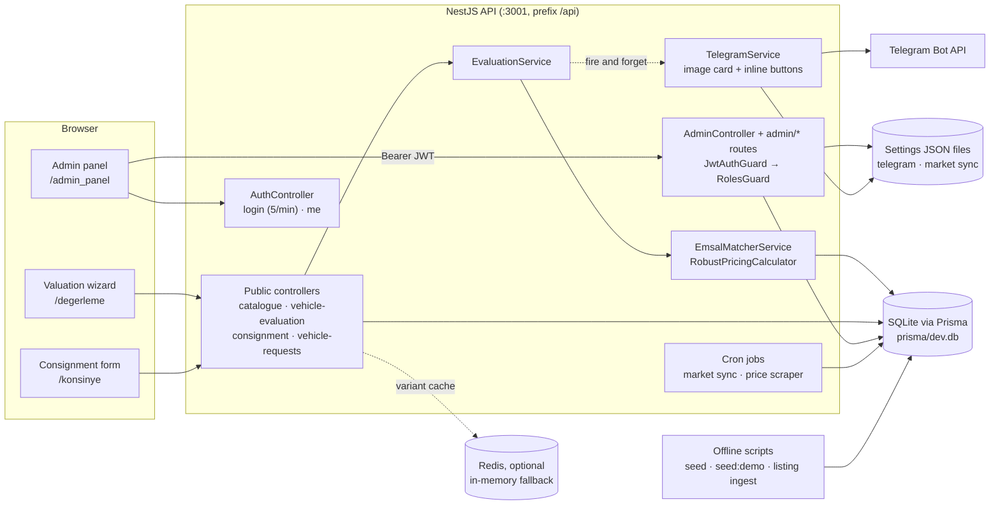
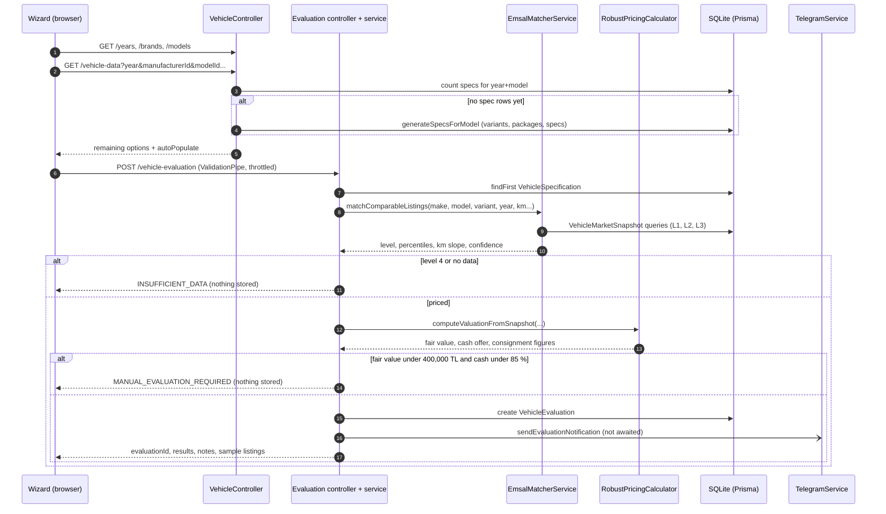
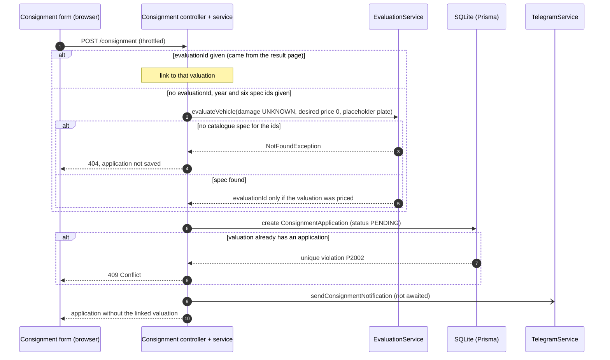
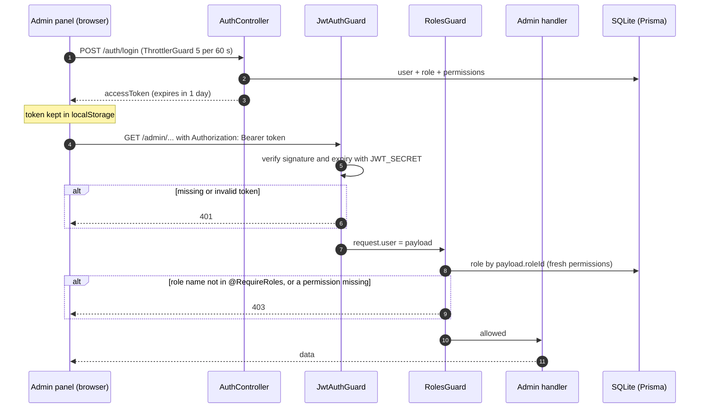
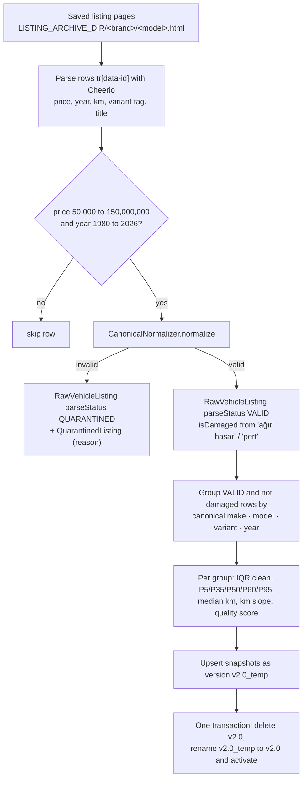
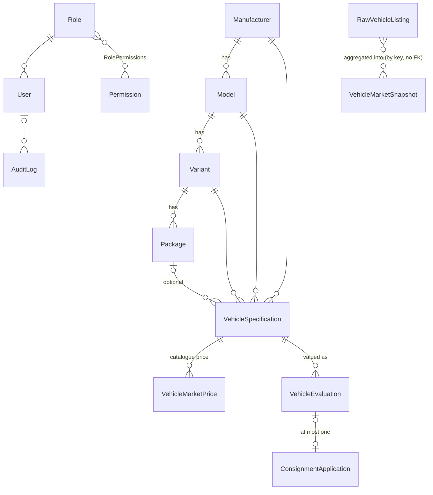
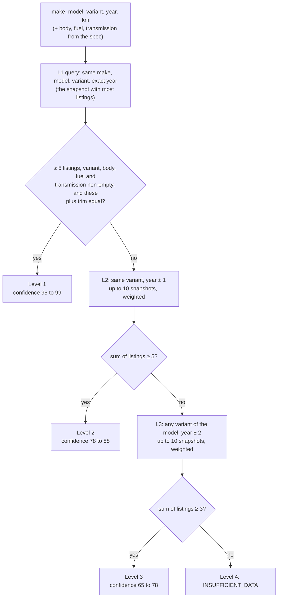

# How NakitGaraj works

This document explains what NakitGaraj does, how the code is organised and why it is built this way. It is written for an engineer who has not seen the repository before. Every rule, threshold and constant below comes from the current code, and each one links to the file that implements it. Test counts come from a run on a fresh clone (see [Testing strategy](#testing-strategy)).

Contents:

1. [What it is and what it is not](#what-it-is-and-what-it-is-not)
2. [Architecture](#architecture)
3. [Runtime flows](#runtime-flows)
4. [Public API reference](#public-api-reference)
5. [Data model](#data-model)
6. [Where the data comes from](#where-the-data-comes-from)
7. [Pricing engine in depth](#pricing-engine-in-depth)
8. [Security model](#security-model)
9. [Notifications and scheduled jobs](#notifications-and-scheduled-jobs)
10. [Design decisions and trade-offs](#design-decisions-and-trade-offs)
11. [Testing strategy](#testing-strategy)
12. [Limitations, known gaps and next steps](#limitations-known-gaps-and-next-steps)
13. [Code tour](#code-tour)
14. [Glossary](#glossary)
15. [Türkçe özet](#türkçe-özet)

---

## What it is and what it is not

**What it is.** A web platform for a used-car dealer that offers sellers two ways to sell:

- **Instant cash offer** ("anında nakit alım"): the dealer buys the car now. The price is the market value minus a reserve that covers the dealer's risk and costs.
- **Consignment** ("konsinye"): the car stays with the dealer, who sells it for a commission. The seller sees a listing price, the expected sale price, the commission and their net payout.

A seller fills in a three-step wizard. The backend prices the car from **market snapshots**, which are statistics aggregated from saved listing pages (comparables, "emsal"), and stores the valuation for the dealer's team. The team works the leads in an admin panel (CRM, users and roles, imports, settings) and gets each new lead in a Telegram group.

**What it is not.**

- Not a production service. The README marks it as work in progress and not in commercial use.
- Not a machine-learning model. The pricing engine is deterministic: percentiles, linear adjustments, tiered reserves and commissions. The explanation strings it returns are stored in a column called `aiAnalysis`, but they are built from templates in [`evaluation.service.ts`](../backend/src/evaluation/evaluation.service.ts). No model is involved.
- Not shipped with real market data. The listing pages that real snapshots are built from are not in the repository. A fresh install answers every valuation with `INSUFFICIENT_DATA` until you import listings or run the synthetic demo seed (`npm run seed:demo`).
- Not a scraper product. The repository contains data-collection tooling (an import script for saved pages, a Playwright price scraper and a Chrome extension prototype) that reads third-party listing sites. The owner has to check those sites' terms of use before any of it runs in production.

---

## Architecture



| Component | Responsibility | Main files |
|---|---|---|
| Next.js frontend | Public site (landing page, valuation wizard, consignment form) and admin panel. Client components that call the API with `fetch`. | [`degerleme/page.tsx`](../frontend/src/app/degerleme/page.tsx), [`konsinye/page.tsx`](../frontend/src/app/konsinye/page.tsx), [`admin_panel/`](../frontend/src/app/admin_panel/page.tsx), [`config/api.ts`](../frontend/src/config/api.ts) |
| Bootstrap | Global `/api` prefix, `trust proxy`, CORS, global `ValidationPipe`, env validation, throttler and scheduler modules. | [`main.ts`](../backend/src/main.ts), [`app.module.ts`](../backend/src/app.module.ts) |
| Catalogue (`vehicle`) | Years, brands, models and the cascading variant/package/body/fuel/transmission options. Generates missing catalogue rows on first use. Missing-vehicle requests. | [`vehicle.service.ts`](../backend/src/vehicle/vehicle.service.ts), [`vehicle.controller.ts`](../backend/src/vehicle/vehicle.controller.ts) |
| Valuation (`evaluation`) | Resolves the catalogue spec, runs the matcher and the calculator, stores the valuation, triggers the notification. | [`evaluation.service.ts`](../backend/src/evaluation/evaluation.service.ts) |
| Pricing engine | Comparable matching on snapshots (four levels) and the price formulas. Pure functions in the calculator. | [`emsal-matcher.service.ts`](../backend/src/evaluation/emsal-matcher.service.ts), [`robust-pricing-calculator.ts`](../backend/src/evaluation/robust-pricing-calculator.ts) |
| Name normaliser | Turns raw make/model/variant strings from listing pages into canonical names, or rejects them. | [`canonical-normalizer.ts`](../backend/src/evaluation/canonical-normalizer.ts) |
| Consignment | Public application endpoint, optional on-the-fly valuation, CRM list and status updates. | [`consignment.service.ts`](../backend/src/consignment/consignment.service.ts) |
| Auth and RBAC | Login, JWT, `JwtAuthGuard`, `RolesGuard`, `@RequirePermissions`, `@RequireRoles`. | [`auth/`](../backend/src/auth/auth.service.ts) |
| Admin | Dashboard, valuations, CRM, users, imports, Telegram and market-sync settings, audit log. | [`admin.controller.ts`](../backend/src/admin/admin.controller.ts), [`admin.service.ts`](../backend/src/admin/admin.service.ts), [`audit.service.ts`](../backend/src/audit/audit.service.ts), [`import.service.ts`](../backend/src/import/import.service.ts) |
| Telegram | HTML-escaped messages, a PNG card drawn with `@napi-rs/canvas`, WhatsApp deep links. | [`telegram.service.ts`](../backend/src/telegram/telegram.service.ts), [`telegram.card-generator.ts`](../backend/src/telegram/telegram.card-generator.ts) |
| Offline data tooling | Seeds, demo seed, the listing ingest that builds snapshots, and many one-off scripts from development. | [`prisma/seed.ts`](../backend/prisma/seed.ts), [`prisma/seed-demo.ts`](../backend/prisma/seed-demo.ts), [`ingest_all_desktop_html_recursive.ts`](../backend/src/scripts/ingest_all_desktop_html_recursive.ts) |

The backend is one NestJS process with one SQLite file, and PM2 runs it next to the Next.js server ([`ecosystem.config.js`](../ecosystem.config.js)). In the documented deployment, Nginx serves both on one origin and forwards `/api` to port 3001 ([DEPLOYMENT.md](../DEPLOYMENT.md), in Turkish).

---

## Runtime flows

### 1. Valuation (public wizard)

The wizard in [`degerleme/page.tsx`](../frontend/src/app/degerleme/page.tsx) has a contact gate and three steps:

- **Contact gate.** Before step 1, a modal asks for first name, last name and a mobile number matching `^(05|5)\d{9}$`. The values are kept in `sessionStorage`.
- **Step 1, vehicle.** Model year, brand and model, then variant, package, body, fuel and transmission. Each choice re-queries `GET /vehicle-data`, which returns only the options that are still possible. A list with exactly one option is preselected through `autoPopulate`.
- **Step 2, condition.** Plate (Turkish plate regex), mileage (at least 1), colour, damage record (`YES` / `NO` / `UNKNOWN`), selling timeline, desired price (at least 1), a 13-part paint/replacement map, chassis, heavy-damage, scratch and glass flags, and an equipment checklist. The checklist needs at least one answer (or "not sure") in each of its four categories before the form can be submitted.
- **Step 3, result.** Cash offer, consignment listing price and the explanation notes.



What the code does on each branch ([`evaluation.service.ts` `evaluateVehicle`](../backend/src/evaluation/evaluation.service.ts)):

- **Spec lookup.** It looks for a `VehicleSpecification` with all the selected ids. If none matches and a variant was given, it retries with year, brand, model and variant only. If there is still no spec, the answer is `404`.
- **Damage penalty.** It comes only from `damageStatus`: `YES` = 8 %, `NO` = 0 %, anything else = 4 %.
- **Stored only when priced.** Only a priced answer is written to `VehicleEvaluation` and sent to Telegram. `INSUFFICIENT_DATA` and `MANUAL_EVALUATION_REQUIRED` answers are returned to the browser and not persisted.
- **Comparable listings.** For a priced answer, the response includes the `RawVehicleListing` rows named by the first five source listing ids in `snapshotDataJson.uniqueListingIds` of the snapshot the matcher reports (in Levels 2 and 3, the merged snapshot with the most listings).
- **What is not used.** The wizard also sends the paint map, chassis state, vehicle status and damage-record (Tramer) amount. The DTO accepts these fields, but the service neither stores nor prices them. Only `features` (the equipment checklist, as JSON) is saved. The wizard's "estimated value decrease" percentage (`calculateEstimatedDamagePenalty`) is computed and shown in the browser only.

### 2. Consignment application



Key points ([`consignment.service.ts` `createConsignment`](../backend/src/consignment/consignment.service.ts)):

- **Two entry points.** From a valuation result, the form opens as `/konsinye?evaluationId=...`, loads `GET /vehicle-evaluation/:id` and sends that id. Opened on its own, the form asks for the vehicle. If the year and the make, model, variant, body, fuel and transmission ids are all present, the service runs a valuation itself, with damage `UNKNOWN`, desired price `0`, default mileage 100,000 and default colour if those are missing, and a placeholder plate. A priced valuation is stored like any other (with the applicant's name and phone) and sends its own Telegram notification, so the team gets two messages for one application. If any of these seven fields is missing, no valuation runs and the application is saved without a link.
- **Outcome of the on-the-fly valuation.** Priced: the application is linked to the new valuation. `INSUFFICIENT_DATA` or `MANUAL_EVALUATION_REQUIRED`: the application is saved without a link. No catalogue spec for the ids: `evaluateVehicle` throws `NotFoundException`, `createConsignment` does not catch it, so the request ends with 404 and **the application is not saved**; the form shows the error message in an alert. The form's own cascading selects only offer ids of existing specs, so this path is reached by direct API calls or stale ids rather than by normal use.
- **One application per valuation.** `ConsignmentApplication.vehicleEvaluationId` is unique, so a second application for the same valuation is answered with 409.
- **No data leak through a guessed id.** `vehicleEvaluationId` comes from the caller. The response therefore strips the linked valuation, so a caller cannot read another customer's name, phone or plate through it.
- **Structured notes.** The form puts the paint map, equipment and vehicle-status answers into `notes` as JSON. `formatConsignmentNotes` in the Telegram service parses that JSON back into readable lines.

### 3. Admin request (login, then a guarded route)



The panel only checks on the client that a token exists in `localStorage` ([`dashboard/layout.tsx`](../frontend/src/app/admin_panel/dashboard/layout.tsx)). It shows every menu entry to every user. The API is the security boundary: every admin route returns 401 or 403 when the check fails.

### 4. Building market data (offline)



This runs on the operator's machine with `npx ts-node src/scripts/ingest_all_desktop_html_recursive.ts` ([source](../backend/src/scripts/ingest_all_desktop_html_recursive.ts)), not inside the API. Details are in [Snapshot building](#snapshot-building).

---

## Public API reference

All paths are under the global `/api` prefix. The public request bodies are DTO classes checked by the global `ValidationPipe`, so an unknown body field is a 400. The admin routes are listed in [Admin routes and their guards](#admin-routes-and-their-guards).

| Route | Guard | Request | Response |
|---|---|---|---|
| `GET /` | none | none | The string `Hello World!` (smoke test). |
| `GET /years` | none | none | Model years as numbers, from the current year down to 2000. |
| `GET /brands` | none | none | `Manufacturer` rows sorted by name. If `LISTING_ARCHIVE_DIR` points at an existing folder with sub-folders, only the brands named by those sub-folders. |
| `GET /models?brandId=` | none | brand id | `Model` rows of that brand. |
| `GET /variants?modelId=` | none | model id | `Variant` rows, cached for one hour (Redis or memory). |
| `GET /vehicle-data` | none | `year`, `manufacturerId`, `modelId`, optional `variantId`, `packageId`, `bodyTypeId`, `fuelTypeId` (`transmissionTypeId` is accepted but filters nothing) | `{ variants, packages, bodyTypes, fuelTypes, transmissionTypes, autoPopulate }`. Each list holds the options that the earlier choices still allow; `autoPopulate` has the id of every list with exactly one entry, otherwise `null`. 400 for a year outside 2000 to the current year or a missing id. May create catalogue rows (see [Sources](#sources)). |
| `POST /vehicle-requests` | throttle | `brand`, `model`, optional `year`, `note`, `phone`, `email` | The created `VehicleRequest` row. |
| `POST /vehicle-evaluation` | throttle | [`CreateEvaluationDto`](../backend/src/evaluation/dto/create-evaluation.dto.ts): `year`, `manufacturerId`, `modelId`, optional spec ids, `mileage` (≥ 0), `color`, `damageStatus`, `licensePlate` (Turkish plate regex), `firstName`, `lastName`, `phone` (`^(05\|5)\d{9}$`), `sellingTimeline`, `userDesiredPrice` (≥ 0), optional JSON strings (`paintScheme`, `chassisState`, `equipments`, `vehicleStatus`, `features`) and `tramerAmount` | One of three shapes, below. 404 when no catalogue spec matches. |
| `GET /vehicle-evaluation/:id` | none; the id is a UUID | none | The stored valuation in a different, smaller shape, below. 404 for an unknown id. |
| `POST /consignment` | throttle | [`CreateConsignmentDto`](../backend/src/consignment/dto/create-consignment.dto.ts): `firstName`, `lastName`, `phone`, `email`, `province`, `district`, `preferredContact`, optional `vehicleEvaluationId`, `notes` (a string; the form sends JSON) and the optional vehicle fields of the on-the-fly valuation | `{ success, message, consignmentId, consignment }`, where `consignment` is the stored row without the linked valuation. 409 for a second application on the same valuation; 404 as described in [Consignment application](#2-consignment-application). An unknown `vehicleEvaluationId` fails the foreign key (Prisma `P2003`), which is not caught, so the answer is 500. |
| `POST /auth/login` | throttle 5 / 60 s | `email`, `password` (at least 6 characters) | `{ accessToken, user: { id, email, firstName, lastName, role } }`; 401 for a wrong e-mail or password (same message for both). |
| `GET /auth/me` | JWT | none | `{ id, email, firstName, lastName, role, permissions }`, read from the database. |

**`POST /vehicle-evaluation` response shapes** ([`evaluation.service.ts` `evaluateVehicle`](../backend/src/evaluation/evaluation.service.ts)):

| State | Top-level fields | `results` |
|---|---|---|
| Priced (no `status` field) | `evaluationId`, `vehicle` (year and the names of make, model, variant, package, body, fuel and transmission, plus `engineSize`, `horsepower`, `originalMSRP`), `results`, `aiAnalysis` (string array), `comparableListings` | `fairMarketValue`, `adjustedP35`, `cashOffer`, `cashOfferMin`, `cashOfferMax`, `consignmentListingPrice`, `expectedConsignmentSalePrice`, `consignmentCommission`, `customerConsignmentNet`, `estimatedDaysToSell` (a string such as `"7-18 gün"`), `confidenceScore` (number), `matchedListingCount`, `matchedLevel`, `pricingExplanation`, plus the aliases below |
| `MANUAL_EVALUATION_REQUIRED` | `status`, `confidenceScore`, `message`, `vehicle` (year and the seven names only), `results`, `aiAnalysis`, `comparableListings: []`; **no `evaluationId`** | The same figures except `adjustedP35`, plus `requiresManualApproval: true`, `kmDecayPer10k`, `referenceMedianMileage`; `pricingExplanation` holds the manual-review reason; **no aliases**, so no `finalOfferedPrice` |
| `INSUFFICIENT_DATA` | `status`, `confidenceScore: 0`, `message`, `vehicle`, `aiAnalysis` (one warning), `comparableListings: []` | `null` |

The priced `results` also carry older field names. They repeat values from the response or the request:

| Alias | Same value as |
|---|---|
| `estimatedValue`, `finalOfferedPrice` | `cashOffer` |
| `minExpectedValue`, `quickSaleValue` | `cashOfferMin` |
| `maxExpectedValue`, `finalConsignmentPrice` | `consignmentListingPrice` |
| `fairMarketRange` | the string `"<cashOfferMin> ₺ - <consignmentListingPrice> ₺"`, formatted for `tr-TR`. Despite the name, it is not a range around the fair market value. |
| `userDesiredPrice` | the request's desired price |

**`GET /vehicle-evaluation/:id`** ([`getEvaluationById`](../backend/src/evaluation/evaluation.service.ts)) can only return what `VehicleEvaluation` stores, so its shape differs: `evaluationId`, `vehicle` (year and the seven names, no ids), `aiAnalysis`, and `results` with `estimatedValue`, `finalOfferedPrice`, `userDesiredPrice`, `fairMarketRange`, `minExpectedValue`, `maxExpectedValue`, `quickSaleValue` and `confidenceScore` as a **string** such as `"80%"`. The fair market value, the expected sale price, the commission and the net payout are not stored and therefore not returned. The consignment form uses this response only to show the vehicle and the cash offer (`estimatedValue`).

---

## Data model

The schema is [`backend/prisma/schema.prisma`](../backend/prisma/schema.prisma) (SQLite; two migrations in [`prisma/migrations`](../backend/prisma/migrations/migration_lock.toml)). It has four groups of tables.



### Catalogue

| Table | What matters |
|---|---|
| `Manufacturer` → `Model` → `Variant` → `Package` | Names are unique per parent (`@@unique([manufacturerId, name])` and so on). `Variant` carries engine size, horsepower, torque and cylinders. |
| `FuelType`, `TransmissionType`, `BodyType`, `DriveType` | Small lookup tables with unique names (for example `Benzin`, `Dizel`, `Manuel`, `Otomatik`). |
| `VehicleSpecification` | One sellable configuration: year + make + model + variant + optional package + body + fuel + transmission + drive. This is what the wizard resolves to. It also holds `originalMSRP` (a catalogue list price) and descriptive fields. |
| `VehicleMarketPrice` | A **catalogue** price per spec (`currentMarketAverage`, `averageListingPrice`, min, max). The pricing engine does not use it; see [Two kinds of price data](#two-kinds-of-price-data). |

### Market data

| Table | What matters |
|---|---|
| `RawVehicleListing` | One parsed listing. `(source, sourceListingId)` is unique. It keeps the raw and the canonical make/model/variant, `year`, `mileageKm`, `price`, `isDamaged`, `parseStatus` (`VALID` or `QUARANTINED`), `parseWarnings` and `lastSeenAt`. |
| `QuarantinedListing` | One row per rejected listing and reason. `(source, rawListingId, reason)` is unique, so re-running the import does not duplicate rows (second migration). |
| `VehicleMarketSnapshot` | The engine's input. It is keyed by eight canonical fields plus `snapshotVersion` (unique together). It stores `year`, `matchedListingCount`, `weightedP5/P35/P50/P60/P95`, `medianMileage`, `kmDecayPer10k`, `mileageAdjustmentSource` and `isActive`. `snapshotDataJson` holds the listing ids and the mileage statistics. The matcher queries the display columns `make`, `model` and `variant`, which the builders fill with the canonical values; no index covers them. |

### Leads and CRM

| Table | What matters |
|---|---|
| `VehicleEvaluation` | A priced valuation. `estimatedValue` and `finalOfferedPrice` hold the **cash offer**, `minExpectedValue` and `quickSaleValue` the lower end of the cash range, and `maxExpectedValue` the **consignment listing price**. The fair market value itself is not stored. It also keeps the customer's name, phone, IP, desired price, selling timeline, the explanation notes (`aiAnalysis`, a JSON string array) and `features` (JSON). |
| `ConsignmentApplication` | Contact data, province/district, preferred channel, `status` (default `PENDING`) and `notes` (JSON from the form). Its optional `vehicleEvaluationId` is unique, which makes the relation one-to-one. The CRM page offers nine status values; the API stores any string. |
| `VehicleRequest` | "My car is not in the list" requests from the wizard (`PENDING`, `ADDED`, `REJECTED`). |
| `VehicleTransactionRecord` | Fields for tracking real purchases and resales (purchase price, costs, profit, days to sell). No code reads or writes it yet. |

### Access control

`User` (email unique, bcrypt hash with cost 10, one role), `Role` (name unique), `Permission` (name unique; many-to-many with roles) and `AuditLog`. The seed creates four permissions (`manage_vehicles`, `view_valuations`, `manage_consignments`, `view_audit_logs`) and two roles: `ADMIN` (all four) and `CRM_MANAGER` (`view_valuations` and `manage_consignments`).

### Settings files

Two settings live in JSON files in the backend's working directory, not in the database. Both are git-ignored.

- `telegram-settings.json`: bot token, chat ids, gallery WhatsApp number, `enabled`. It is created from the `TELEGRAM_*` and `GALLERY_WHATSAPP_PHONE` variables on first start.
- `market-sync-settings.json`: whether the monthly sync is on, the monthly rate, and four margin fields.

---

## Where the data comes from

### Two kinds of price data

The most important thing to understand about the data is that the code keeps **two separate kinds of price data**:

1. **Catalogue prices.** These are `VehicleSpecification.originalMSRP` and `VehicleMarketPrice`. They are produced by formulas: the seed, the recalibration curves and lazy catalogue generation. The admin import, the price scraper, the monthly market sync and the "adjust market prices" endpoint also write them. The valuation response shows `originalMSRP`, and the demo seed uses `averageListingPrice` as the centre of its synthetic listings. **The pricing engine never reads them.**
2. **Market snapshots.** These are `VehicleMarketSnapshot` rows built from `RawVehicleListing` rows. They come from the listing ingest script or from the demo seed. **Every cash and consignment offer is computed from these.**

So the scraper, the monthly sync and the price-adjust endpoint change catalogue numbers, but they do not change the offers a customer sees.

### Sources

| Source | Writes | How it works |
|---|---|---|
| `npx prisma db seed` ([`seed.ts`](../backend/prisma/seed.ts)) | Permissions, roles, admin user, catalogue | Requires `ADMIN_PASSWORD`. It upserts the admin user, then builds 12 brands, 18 models, 30 variants and 76 packages for model years 2005 to 2026, which gives 1,672 specs, each with a `VehicleMarketPrice`. Prices start from `basePrice × max(0.48, 1 − age·0.025 − age^1.2·0.002) × package factor` (1.08, 1.18 or 1.25 for named package groups). Then [`recalibrateAllSpecs`](../backend/src/recalibrate_all_vehicle_variants.ts) rewrites `originalMSRP` and the catalogue prices from per-brand base prices and four depreciation curves (exotic, luxury, standard, economy). If more than 1,000 specs already exist, it stops after the permissions, roles, admin user and lookup tables and leaves the catalogue alone. |
| `npm run seed:demo` ([`seed-demo.ts`](../backend/prisma/seed-demo.ts)) | Synthetic listings and snapshots | It refuses to run with `NODE_ENV=production`. For each make · model · variant · year group of the last 12 model years (currently 2014 to 2025), it creates 14 listings with source `DEMO_SYNTHETIC`. They are centred on the catalogue `averageListingPrice`, with mileage drawn between 0.55 and 1.45 × `age × 15,000 km`, a 0.4 % per 10,000 km price slope and plus or minus 7 % price noise. It aggregates them with the same `cleanOutliersIQR` and `calculatePercentiles` functions as the real import and marks the snapshots `"demo": true`. On a fresh seed it created 5,040 listings and 360 snapshots. **The synthetic prices differ on every fresh database**; see [Demo data is not reproducible across databases](#demo-data-is-not-reproducible-across-databases). |
| Listing ingest ([`ingest_all_desktop_html_recursive.ts`](../backend/src/scripts/ingest_all_desktop_html_recursive.ts)) | Real listings, quarantine, snapshots | It reads saved search-result pages from `LISTING_ARCHIVE_DIR` (one folder per brand, file name = model; see [`listing-archive-dir.ts`](../backend/src/scripts/listing-archive-dir.ts)). See [Snapshot building](#snapshot-building). |
| Lazy catalogue generation ([`vehicle.service.ts` `generateSpecsForModel`](../backend/src/vehicle/vehicle.service.ts)) | Variants, packages, specs | When `GET /vehicle-data` is asked for a year and model that have no specs, it creates them from built-in variant lists per brand and model (or generic ones). Prices follow `floor + (base − floor) × 0.88^age`, with age counted from 2026. The year must be an integer from 2000 to the current year, so public callers cannot create rows for arbitrary years. |
| Admin import (`POST /admin/import`, [`import.service.ts`](../backend/src/import/import.service.ts)) | Catalogue rows and catalogue prices | CSV, Excel (first sheet) or JSON array. Each row needs brand, model, variant and year. Missing technical fields get defaults. |
| Price scraper ([`scripts/scraper.ts`](../backend/src/scripts/scraper.ts), run by [`ScraperCronService`](../backend/src/scraper/scraper-cron.service.ts)) | Catalogue prices only | For each spec, it searches one listing site and then another for "brand model year" with Playwright, averages the prices on the first result page, and writes `VehicleMarketPrice`. If it is blocked or finds nothing, it writes a formula estimate instead (`source = 'Fallback Model'` in the log). |
| Chrome extension ([`chrome-extension/`](../chrome-extension/manifest.json)) | Nothing yet | A prototype content script that posts a listing to `http://localhost:3000/api/listings/import`. No such endpoint exists. |

The scraper and the extension are data-collection tooling aimed at third-party listing sites. Whether running them is allowed depends on those sites' terms of use, which the owner has to check.

### Demo data is not reproducible across databases

[`seed-demo.ts`](../backend/prisma/seed-demo.ts) draws all random numbers from one PRNG stream with a fixed seed (`mulberry32(20260930)`). The comment there says this makes every run produce the same data, but that holds only for the same database. The groups consume the stream in the order of the catalogue query, which sorts by `manufacturerId`, `modelId` and `variantId`. These ids are random UUIDs that `prisma db seed` creates, so each fresh database hands different random numbers to each make · model · variant · year group.

What stays the same is the structure: the counts (14 listings per group, 5,040 listings and 360 snapshots with a 2026 clock), the price centre of each group (the mean catalogue price, which is deterministic) and the match level a given car gets. The percentiles, the median mileages and therefore every offer change. For a 2020 Fiat Egea 1.4 Fire, two fresh databases gave a 2019 snapshot P50 of 598,000 and 581,000 TL. The year window also moves with the system clock: it is always the 12 model years before the current one.

For this reason the [worked example](#worked-example-fixed-snapshot-input) below starts from fixed snapshot rows rather than from "run the demo seed".

### Demo and real listings share one table

The demo seed and the listing ingest write to the same `RawVehicleListing` table, and nothing in the ingest separates them:

- **The ingest reads every source.** It builds snapshots from all rows with `parseStatus = 'VALID'` and `isDamaged = false`, with no filter on `source`. Demo rows qualify (their `isDamaged` defaults to `false`).
- **Demo rows lose their marker.** If `seed:demo` ran before an ingest, the demo listings are grouped with the real ones whenever the canonical names match, and form their own groups otherwise. The resulting snapshots carry no `"demo": true` marker, because the ingest's `snapshotDataJson` has no such field.
- **The swap removes the marked snapshots.** The ingest's swap transaction deletes every `v2.0` row, including the demo-marked ones, and replaces them with these unmarked snapshots.
- **A later `seed:demo` cannot clean up.** It deletes the `DEMO_SYNTHETIC` listings and the snapshots that contain `"demo":true`. The unmarked snapshots built from demo listings stay, and still point at listing ids that no longer exist. Its `upsert` also uses `update: {}`, so it does not overwrite an existing snapshot with the same canonical key.

In short, run the demo seed only on a database that will never see a real import, or delete the `DEMO_SYNTHETIC` listings before importing.

---

## Pricing engine in depth

The pricing engine has four stages: normalise names, build snapshots, match the closest snapshot, then turn its percentiles into offers.

### Name normalisation

Listing pages name the same car in many ways, and the archive's file names carry site boilerplate. [`CanonicalNormalizer.normalize`](../backend/src/evaluation/canonical-normalizer.ts) makes these names comparable:

1. **`cleanString`.** It strips trailing page suffixes (` - 4`), a list of boilerplate phrases (site names, "Satılık", "2.El", "Modelleri" and others), hyphens and underscores.
2. **Brand.** A substring map on the upper-cased, Turkish-folded make maps 20 brands to fixed spellings (for example anything containing `MERCEDES` becomes `Mercedes-Benz`). Other makes keep their cleaned name. A make shorter than two characters is quarantined (`GEÇERSİZ_MARKA_TESPİTİ`).
3. **Model.** Brand-specific rules extract the model from the model string, the title or the variant tag. For example, BMW `320` becomes `3 Serisi` and Alfa Romeo text containing `GIULIETTA` becomes `Giulietta`. For DS, BYD, Cupra and Daihatsu, an unknown model is quarantined. A model that is empty, generic, equal to the brand or contains boilerplate is quarantined (`GEÇERSİZ_MODEL_TESPİTİ`).
4. **Variant.** Generic values (`Standart`, numeric-only strings, boilerplate) become `null`. A model-level listing is still valid; it just has no variant.

The design choice is to **quarantine rather than guess**. A listing whose make or model cannot be determined never reaches a snapshot, and the reason is kept for review.

### Snapshot building

Inside the ingest script ([source](../backend/src/scripts/ingest_all_desktop_html_recursive.ts)):

- **Row filter.** A row is kept only if its price is between 50,000 and 150,000,000 TL and its year is between 1980 and 2026. Mileage is kept if it is between 0 and 2,000,000 and not equal to the year or the price (a guard against shifted cells).
- **Damage flag.** `isDamaged` is set when the row text contains "ağır hasar" (heavy damage) or "pert" (write-off). Damaged listings are stored but excluded from snapshots, so snapshots describe clean cars and damage is priced separately.
- **Grouping and deduplication.** Listings are grouped by canonical make · model · variant · year. Within one run, a listing id is kept once, and existing rows are updated in place with a new `lastSeenAt`.
- **Outliers** ([`RobustPricingCalculator.cleanOutliersIQR`](../backend/src/evaluation/robust-pricing-calculator.ts)). It keeps prices between 50,000 and 150,000,000. With four or more prices it sorts them, computes `Q1 = sorted[⌊0.25n⌋]`, `Q3 = sorted[⌊0.75n⌋]` and returns the sorted prices in `[max(50,000, Q1 − 1.5·IQR), Q3 + 1.5·IQR]`. With fewer than four it returns them unfiltered **and in input order** (an early return before the sort).
- **Percentiles** (`calculatePercentiles`). Nearest rank `sorted[⌊p·n⌋]` for P5, P35, P50, P60 and P95. The function assumes sorted input. For groups of four or more listings that holds. For groups of two or three it does not: the ingest passes prices in database order, so the "percentiles" are positions in that order. For example, `[900,000, 500,000, 700,000]` gives P5 900,000, P35 to P60 500,000 and P95 700,000, so P5 is above P50 (checked by running the two functions). Level 3 accepts a single snapshot with three listings, so such values can reach an offer. The demo seed always has 14 listings per group and is not affected. The columns are named `weighted…` because the matcher later averages several snapshots with weights; inside one snapshot they are plain percentiles.
- **Mileage statistics.** The median and the average of the listings with a mileage. With 8 or more such listings, it fits an ordinary least-squares line of price against `km / 10,000`. If the slope is negative, `kmDecayPer10k = clamp(|slope| / P50, 0.001, 0.015)`, which is the fraction of the median price lost per 10,000 km, and the source is `LEARNED_FROM_LISTINGS`. Otherwise the decay stays at the default 0.0025, with source `LIMITED_SAMPLE` (4 to 7 samples) or `DEFAULT_FALLBACK`.
- **Technical metadata.** Body, fuel, transmission and trim are copied from the first catalogue spec with the same make · model · variant · year. If there is none, they stay empty, and an empty field rules out a Level 1 match later.
- **Quality score** (`calculateDataQualityScore`). 50 points, plus up to 20 for listing count, up to 15 for mileage coverage, up to 15 for complete metadata, plus `max(0, 15 − 30·CV)` for price consistency. It is stored but not used by the matcher.
- **Atomic swap.** Snapshots are written as version `v2.0_temp` (inactive). One transaction then deletes the old `v2.0` rows (all of them, demo snapshots included; see [Demo and real listings share one table](#demo-and-real-listings-share-one-table)) and renames the new ones. A valuation running during an import therefore sees either the complete old set or the complete new set, never a half-built one.

### Comparable matching (four levels)

[`EmsalMatcherService.matchComparableListings`](../backend/src/evaluation/emsal-matcher.service.ts) only reads active `v2.0` snapshots. It walks down from the most specific to the broadest match and stops at the first level that has enough data:



**Level 1** needs at least 5 listings in the exact-year snapshot. On top of that, variant, body, fuel and transmission must be non-empty on both sides and equal, case-insensitively, together with make, model and trim. Confidence is `min(99, max(83, 95 + ⌊n/12⌋))`.

**Levels 2 and 3** merge up to 10 snapshots and move them to the requested year (`queryWeightedSnapshotsFromDb`). The query orders by `matchedListingCount` descending and has no tie-breaker, so snapshots with equal counts come back in whatever order SQLite returns them. Each snapshot's year difference is `d = userYear − snapshotYear`.

- **Learned yearly rate.** Take the oldest and the newest year among the merged snapshots with `P50 > 0`, with medians `p1` and `p2`: `rate = (p2 / p1)^(1 / (y2 − y1)) − 1`. The rate is used only if `0.01 < rate < 0.20` (`LEARNED_YEAR_ADJUSTMENT`). Otherwise the default 0.08 is used (`DEFAULT_YEAR_ADJUSTMENT`). When two merged snapshots share a model year (Level 3 merges several variants), the one later in the query order sets that year's median.
- **Price factor.** Each percentile is multiplied by `1 + d · rate`. This is a linear adjustment toward the requested year.
- **Weight.** `matchedListingCount × 0.92^|d|`, so a snapshot one year away counts 8 % less than the exact year.
- **Result.** Each percentile is the weight-averaged value. The listing count is the plain sum, and confidence is `min(88, max(76, 78 + ⌊n/20⌋))` for Level 2 and `min(78, max(62, 65 + ⌊n/25⌋))` for Level 3.
- **Mileage reference: the last snapshot wins.** The reference median mileage, the km decay and the mileage source are **not** weighted. The loop reads them from each snapshot's `snapshotDataJson` and overwrites the previous values, so the snapshot that comes last in the query order supplies all three (both builders always write all three). That is the one with the fewest listings or, among equal counts, whichever SQLite returns last. It can be a different model year than the requested one, or in Level 3 a different variant. The prices are moved to the requested year; this reference is not. A newer model year usually has a lower median mileage, so when its snapshot comes last the car looks over-driven and loses value; an older one does the opposite. The [worked example](#worked-example-fixed-snapshot-input) shows the size of the effect.
- **Variant filter.** Variants named `Standart` or `FarkliVaryant` (or empty) do not filter the query.
- **Display columns.** The query filters on the `make`, `model` and `variant` display columns, not on the `canonical*` columns of the unique key. Both snapshot builders fill the two sets with the same values. No index covers these columns; see [Limitations](#limitations-known-gaps-and-next-steps).

**Level 4** means not enough data. The service answers `INSUFFICIENT_DATA` and stores nothing.

If a snapshot lacks a percentile, it is derived from P50: P5 = 0.85, P35 = 0.92, P60 = 1.02 and P95 = 1.15 × P50. Mileage fallbacks are a reference median of 100,000 km and a decay of 0.0025. Level 1 takes its reference median from the snapshot's `snapshotDataJson` and its decay from the `kmDecayPer10k` column; both builders write the same decay to both places.

### Fair market value

[`computeValuationFromSnapshot`](../backend/src/evaluation/robust-pricing-calculator.ts) starts from the merged P50:

```text
kmDelta            = userKm − referenceMedianKm
kmRatio            = clamp((kmDelta / 10,000) × kmDecayPer10k, −0.10, +0.12)
mileageAdjustment  = −round(P50 × kmRatio)
conditionAdjustment= −round(P50 × damagePenalty)        // YES 0.08 · NO 0 · UNKNOWN 0.04
fairMarketValue    = max(100,000, round(P50 + mileageAdjustment + conditionAdjustment))
```

The clamp limits the mileage effect to at most +10 % for a low-mileage car and at most −12 % for a high-mileage one. If no reference median is passed, the calculator uses `age × 15,000 km` with `age = max(1, currentYear − modelYear)`. The valuation service always passes a reference, falling back to 100,000 km, so that branch matters only for direct calls (for example, the tests).

The car's age has no separate depreciation term. It enters through the choice of the model-year snapshot and the year normalisation in Levels 2 and 3.

### Cash offer

```text
reserveRate, minReserve by fair value:
  ≤ 1,000,000      8.0 %   min  65,000
  ≤ 2,500,000      6.5 %   min  85,000
  ≤ 5,000,000      5.5 %   min 130,000
  >  5,000,000     4.5 %   min 220,000
velocity: fair value < 1,000,000 → −0.5 pp (7–18 days to sell)
          fair value > 5,000,000 → +1.0 pp (20–42 days), otherwise 14–28 days
thin data: fewer than 8 listings → +2.5 pp reserve and −10 confidence

reserve      = max(minReserve, round(fairValue × finalRate))
adjustedP35  = round(P35 + mileageAdjustment + conditionAdjustment)
cashOffer    = roundDown(min(fairValue − reserve, adjustedP35))
roundDown    = to 5,000 when ≤ 1,000,000, else to 10,000
cash range   = roundDown(0.96 × cash) … roundDown(1.02 × cash)
```

The code writes the offer as two branches ("if the P35 gap is smaller than the reserve, use fair value minus reserve, otherwise take the minimum of both"). Both branches reduce to `min(fairValue − reserve, adjustedP35)`. The cash offer is therefore never above the 35th percentile of comparable prices, after the same mileage and damage adjustments. When P35 sits close to P50, the reserve still applies, and unit test 6 in [`pricing_engine.spec.ts`](../backend/src/evaluation/pricing_engine.spec.ts) checks exactly that.

**Manual evaluation rule.** If the fair value is below 400,000 TL and `cashOffer / fairValue < 0.85`, the answer is `MANUAL_EVALUATION_REQUIRED` instead of an offer. Because the minimum reserve in that segment is 65,000 TL, every car valued under 400,000 TL meets this condition: `65,000 / 400,000 = 16.25 %`, which is more than the 15 % the rule allows. In practice the rule means "no automatic offers below 400,000 TL".

### Consignment offer

```text
adjustedP60     = round(P60 + mileageAdjustment + conditionAdjustment)
listingPrice    = psych(min(adjustedP60, round(1.03 × fairValue)))
  if desiredPrice > 0:
  listingPrice  = psych(min(desiredPrice, round(1.03 × 1.05 × fairValue)))
psych(x)        = ⌊x / 1,000⌋ × 1,000 − 1,000   (if that is > 100,000, else x)
expectedSale    = max(cashOffer + 30,000, listingPrice − round(1.5 % × listingPrice))
commission      = max(minCommission, round(expectedSale × rate))
  expectedSale ≤ 1,500,000   4.5 %  min  50,000
               ≤ 4,000,000   3.5 %  min  80,000
               ≤ 7,000,000   3.0 %  min 120,000
               >  7,000,000   2.5 %  min 175,000
customerNet     = expectedSale − commission
```

The listing price targets the 60th percentile, capped at 3 % above fair value and rounded to a "…000 − 1,000" price (650,500 becomes 649,000). If the seller states a desired price, the listing follows it, capped at about 8.15 % above fair value (1.05 × 1.03). The expected sale price assumes 1.5 % negotiation and never falls below cash offer + 30,000 TL. That floor means the consignment payout is meant to beat the cash offer; the unit test "keeps cash offer < fair value < consignment listing" in [`robust-pricing-calculator.spec.ts`](../backend/src/evaluation/robust-pricing-calculator.spec.ts) asserts this ordering.

The wizard requires a desired price of at least 1 TL, so wizard valuations always take the desired-price branch. The consignment form's on-the-fly valuation sends 0 and takes the P60 branch.

### Worked example (fixed snapshot input)

The demo seed gives different numbers on every fresh database (see [Demo data is not reproducible across databases](#demo-data-is-not-reproducible-across-databases)), so this example starts from fixed input: the three Level 2 snapshots that one fresh `prisma db seed` plus `npm run seed:demo` produced for the Fiat Egea 1.4 Fire. The prices are synthetic. Every number below follows from these rows and the formulas above. They were checked by passing the rows to the real `EmsalMatcherService` (with a stub in place of Prisma) and `RobustPricingCalculator`, and they match a direct `EvaluationService.evaluateVehicle` call on that database.

Request: 2020 Fiat Egea 1.4 Fire, 90,000 km, damage `NO`.

| Snapshot, in query order | Listings | P5 | P35 | P50 | P60 | P95 | Median km |
|---|---|---|---|---|---|---|---|
| 2019 | 14 | 553,000 | 583,000 | 598,000 | 600,000 | 633,000 | 102,000 |
| 2020 | 14 | 609,000 | 617,000 | 646,000 | 647,000 | 676,000 | 91,000 |
| 2021 | 14 | 676,000 | 687,000 | 716,000 | 720,000 | 750,000 | 85,000 |

All three rows have trim `Easy`, body `Sedan`, fuel `Benzin`, transmission `Manuel` and a km decay of 0.004. Their listing counts are equal, so the query's order is not defined. SQLite returned them in year order, the order the demo seed inserted them, in both runs made for this document.

| Step | Value |
|---|---|
| Level 1 | The 2020 snapshot has 14 listings, but `evaluateVehicle` passes no trim and `''` is not `Easy`, so no Level 1. |
| Level 2 | 3 snapshots, 42 listings (at least 5). Confidence `min(88, max(76, 78 + ⌊42/20⌋))` = 80. |
| Learned yearly rate | `(716,000 / 598,000)^(1/2) − 1` = 9.42 %, inside the 1 % to 20 % band. |
| Weights and price factors | 2019: `14 × 0.92` = 12.88, factor 1.0942. 2020: 14, factor 1. 2021: 12.88, factor 0.9058. |
| Merged percentiles | P5 608,809 · P35 625,488 · P50 649,525 · P60 651,760 · P95 682,471 |
| Mileage | The last row (2021) supplies the reference: 85,000 km, decay 0.40 % per 10,000 km. Delta +5,000 km gives `−round(649,525 × 0.5 × 0.004)` = −1,299 TL. |
| Fair market value | 649,525 − 1,299 = **648,226 TL** |
| Reserve | 8 % − 0.5 % = 7.5 % gives 48,617 TL, below the 65,000 TL minimum, so 65,000 TL. |
| Cash offer | `min(648,226 − 65,000, adjusted P35 624,189)` = 583,226, rounded down to **580,000 TL** (range 555,000 to 590,000), 7 to 18 days to sell. |
| Consignment, desired price 0 | Adjusted P60 650,461 is under the cap of 667,673, so the listing is **649,000 TL**. Expected sale `max(610,000, 649,000 − 9,735)` = 639,265; commission `max(50,000, 28,767)` = 50,000; net 589,265. |
| Consignment, desired price 700,000 | Cap `round(648,226 × 1.05 × 1.03)` = 701,056, so the listing is **699,000 TL**. Expected sale 688,515; commission 50,000; net 638,515. |

**Effect of the last-snapshot rule.** The requested year's own snapshot (2020) has a median of 91,000 km. With that reference the mileage adjustment would be +260 TL, the fair value 649,785 TL and the P60 listing 651,000 TL; the cash offer would stay at 580,000 TL. In the second fresh database the same rule took the 2021 median (79,000 km) instead of the 2020 one (96,000 km) and lowered the cash offer from 575,000 to 570,000 TL. That database's full result was a learned rate of 9.5 %, a fair value of 636,129 TL and a cash offer of 570,000 TL: the same steps with different synthetic inputs.

**Why Level 2 and not Level 1.** `evaluateVehicle` does not pass the package as `trim`, so Level 1 only matches a snapshot whose trim is empty. The demo snapshots, like real snapshots built from catalogue specs with a package, carry a trim, so their valuations resolve at Level 2 or 3. See [Limitations](#limitations-known-gaps-and-next-steps).

### Response states

| Status | When | Stored | Notification |
|---|---|---|---|
| (no status field) priced | Levels 1 to 3 and not manual | `VehicleEvaluation` | yes |
| `MANUAL_EVALUATION_REQUIRED` | fair value < 400,000 TL (see above) | no | no |
| `INSUFFICIENT_DATA` | Level 4 | no | no |
| HTTP 404 | no catalogue spec for the selection | no | no |
| HTTP 400 | DTO validation (plate, phone, numbers, unknown fields) | no | no |

`EvaluationService.calculateVehicleValuationPreview` runs the same pipeline without writing anything and returns `status: 'SUCCESS'` for priced results. Tests and a reporting script use it; no route exposes it.

---

## Security model

| Concern | Mechanism | Where |
|---|---|---|
| Secret at boot | `validateEnv` runs inside `ConfigModule.forRoot`. A missing or blank `JWT_SECRET` stops the app. A secret whose SHA-256 matches one of the two values that were once committed to this repository stops the app in **every** environment, with instructions to rotate it. The `.env.example` placeholders stop the app in production and only print a warning elsewhere. Only digests of the leaked values are kept in the source, and the error never echoes the secret. | [`env.validation.ts`](../backend/src/config/env.validation.ts) |
| Sessions | `POST /auth/login` checks a bcrypt hash and signs a JWT with `JWT_SECRET` through `ConfigService.getOrThrow` (no fallback), valid for one day. The payload carries user id, email, names, role name, `roleId` and permission names. | [`auth.service.ts`](../backend/src/auth/auth.service.ts), [`auth.module.ts`](../backend/src/auth/auth.module.ts) |
| Authentication | `JwtAuthGuard` accepts only `Authorization: Bearer …`, verifies signature and expiry, and puts the payload on `request.user`. Otherwise it answers 401. | [`jwt.guard.ts`](../backend/src/auth/jwt.guard.ts) |
| Authorisation (RBAC) | `@RequirePermissions(...)` and `@RequireRoles(...)` set route metadata. `RolesGuard` loads the role by the token's `roleId` **from the database**, so permission changes apply at once. It requires all listed permissions and, for `@RequireRoles`, a role name from the list; otherwise it answers 403. A route with neither decorator passes this guard, which is why the e2e suite checks that every admin route rejects a role without permissions. The per-route requirements are in the [table below](#admin-routes-and-their-guards). | [`permissions.decorator.ts`](../backend/src/auth/permissions.decorator.ts), [`roles.guard.ts`](../backend/src/auth/roles.guard.ts), [`admin.controller.ts`](../backend/src/admin/admin.controller.ts) |
| Rate limiting | `ThrottlerModule` defaults to 100 requests per 60 s per client IP. The guard is not global: it is attached to login (overridden to 5 per 60 s) and to the three public forms (valuation, consignment, vehicle request). The counters live in process memory. | [`auth.controller.ts`](../backend/src/auth/auth.controller.ts), [`app.module.ts`](../backend/src/app.module.ts) |
| Client IP behind Nginx | `app.set('trust proxy', 'loopback')`: `X-Forwarded-For` is honoured only when the direct peer is localhost (Nginx on the same host). A remote client cannot spoof its IP to get around the login limit or pollute audit logs. | [`main.ts`](../backend/src/main.ts) |
| CORS | `CORS_ORIGIN` set: only those origins, with credentials. Unset in production: `origin: false`, so no CORS headers are sent and browsers block cross-origin reads; the site calls the API on its own origin through Nginx `/api`. Unset outside production: every origin is allowed, so `next dev` on :3000 can call :3001. | [`cors.ts`](../backend/src/config/cors.ts) |
| Input validation | Global `ValidationPipe` with `whitelist`, `forbidNonWhitelisted` and `transform`. Unknown fields are a 400. DTOs check the plate and phone regexes, numbers, minimums and e-mail. | [`main.ts`](../backend/src/main.ts), [`create-evaluation.dto.ts`](../backend/src/evaluation/dto/create-evaluation.dto.ts) |
| Customer data | Public responses never echo another customer's personal data. The consignment endpoint strips the linked valuation, and `GET /vehicle-evaluation/:id` (looked up by an unguessable UUID) returns the vehicle, the offer figures and the notes, without name, phone, plate or IP. | [`consignment.service.ts`](../backend/src/consignment/consignment.service.ts), [`evaluation.service.ts` `getEvaluationById`](../backend/src/evaluation/evaluation.service.ts) |
| Telegram injection | Messages use `parse_mode: HTML`. Every customer-typed value goes through `escapeTelegramHtml`, so a stray `<` cannot break the message or inject links. | [`telegram.service.ts`](../backend/src/telegram/telegram.service.ts) |
| Seed | No default admin password: the seed stops before writing anything when `ADMIN_PASSWORD` is missing. | [`seed.ts`](../backend/prisma/seed.ts) |

The posture is to **fail closed**. Without a usable secret the API does not start. Without `CORS_ORIGIN`, production allows no cross-origin reads. An admin route added without a permission check fails the e2e suite, because every `/admin` route must be in the test's inventory and must reject a user without permissions (see [Testing strategy](#testing-strategy)).

### Admin routes and their guards

All 23 routes under `/api/admin`. The 19 in [`admin.controller.ts`](../backend/src/admin/admin.controller.ts) get `JwtAuthGuard` and `RolesGuard` at class level; the 4 in [`vehicle.controller.ts`](../backend/src/vehicle/vehicle.controller.ts) get them per method. Requirements come from the `@RequirePermissions` and `@RequireRoles` decorators.

| Route | Requires | What it does |
|---|---|---|
| `GET /admin/dashboard` | `view_valuations` | Counts, the average stored cash offer, and the five latest valuations and consignment applications. |
| `GET /admin/evaluations` | `view_valuations` | Stored valuations with customer data. |
| `GET /admin/vehicle-requests` | `view_valuations` | "My car is not listed" requests. |
| `POST /admin/vehicle-requests/:id/status` | **`manage_vehicles`** | Sets a request's status. |
| `GET /admin/consignments` | `manage_consignments` | Consignment applications with their linked valuations. |
| `POST /admin/consignments/:id/status` | `manage_consignments` | Sets status and notes; audit-logged. |
| `GET /admin/logs` | `view_audit_logs` | Audit log. |
| `POST /admin/import` | `manage_vehicles` | CSV, Excel or JSON catalogue import; audit-logged. |
| `POST /admin/scraper/trigger` | `manage_vehicles` | Starts the price scraper in the background; audit-logged. |
| `GET /admin/scraper/status` | `manage_vehicles` | Scraper running flag. |
| `GET /admin/market-sync/settings` | `manage_vehicles` | Reads `market-sync-settings.json`. |
| `POST /admin/market-sync/settings` | `manage_vehicles` | Merges the body into that file. |
| `GET /admin/market-sync-settings` | `manage_vehicles` | Same as above, second path (`VehicleController`). |
| `POST /admin/market-sync-settings` | `manage_vehicles` | Same as above, second path. |
| `POST /admin/trigger-market-sync` | `manage_vehicles` | Runs the monthly `originalMSRP` sync now; does nothing while the sync is disabled in the settings. |
| `POST /admin/adjust-market-prices` | `manage_vehicles` | Scales `originalMSRP` by a percentage, optionally for one brand. |
| `GET /admin/users` | role `ADMIN` | Staff list. |
| `POST /admin/users` | role `ADMIN` | Creates a user; the role defaults to `STAFF`. |
| `DELETE /admin/users/:id` | role `ADMIN` | Deletes a user. |
| `PATCH /admin/users/:id/password` | role `ADMIN` | Sets a password (at least 6 characters). |
| `GET /admin/telegram/settings` | role `ADMIN` | Reads the Telegram settings. |
| `POST /admin/telegram/settings` | role `ADMIN` | Saves them. |
| `POST /admin/telegram/test` | role `ADMIN` | Sends a test message. |

What the two seeded roles can do follows from this table. `ADMIN` has all four permissions and the `ADMIN` role, so it passes every route. `CRM_MANAGER` has `view_valuations` and `manage_consignments`: it can open the dashboard, the valuations, the vehicle-request list and the consignment CRM, and change consignment statuses. It **cannot** change a vehicle request's status, because that route needs `manage_vehicles`; the "Araç Talepleri" page shows the buttons, and the API answers 403. The e2e suite proves that every route rejects a role without permissions, and that the 7 role routes reject a non-`ADMIN` role with every permission. It does not pin which permission each of the other 16 routes needs; this table is read from the decorators.

---

## Notifications and scheduled jobs

**Telegram** ([`telegram.service.ts`](../backend/src/telegram/telegram.service.ts)):

- **Valuations.** Each priced valuation, and each consignment application, triggers a notification. The service draws a PNG card (vehicle, prices and the paint map when one is present) with `@napi-rs/canvas` and posts it with `sendPhoto` to every chat id in the settings. If drawing or sending the photo fails, it falls back to a plain `sendMessage`.
- **Inline buttons.** "Message the customer on WhatsApp" opens a `wa.me` link to the customer's number, converted to the `90…` country format. "Forward to manager" opens a link to the gallery number with a prefilled summary; the button appears only when a gallery number is configured.
- **Fire and forget.** The request does not await the notification. Telegram being slow or down never fails a valuation or an application; errors are only logged.
- **Settings.** The bot token and chat ids come from `telegram-settings.json`, editable by `ADMIN` users. `POST /admin/telegram/test` sends a test message, optionally with a token and chat ids that are not saved yet.

**Monthly market sync** ([`market-sync-cron.service.ts`](../backend/src/vehicle/market-sync-cron.service.ts)): it runs at midnight on the 1st of each month (`EVERY_1ST_DAY_OF_MONTH_AT_MIDNIGHT`). When enabled, it multiplies every spec's `originalMSRP` by `1 + monthlyInflationPercentage / 100` (default 2.5) in transactions of 500 updates. It then posts a Telegram summary. It can also be run from the admin API.

**Price scraper** ([`scraper-cron.service.ts`](../backend/src/scraper/scraper-cron.service.ts)): cron `0 3 */14 * *`, which runs at 03:00 on days 1, 15 and 29 of each month. An `isRunning` flag prevents overlapping runs, and the admin trigger starts it in the background. It rotates proxies from `SCRAPER_PROXIES` / `SCRAPER_PROXY`, recreates the browser every 15 specs and waits 1.5 to 3 s between requests.

Both jobs update catalogue prices only (see [Two kinds of price data](#two-kinds-of-price-data)).

**Audit log** ([`audit.service.ts`](../backend/src/audit/audit.service.ts)): it records consignment status changes, catalogue imports and manual scraper runs, with user id, IP and details.

---

## Design decisions and trade-offs

- **Comparables over a depreciation formula.** The engine prices from what similar cars are listed for, not from a list price times an age curve. Formulas would need constant recalibration in a high-inflation market, while listing percentiles follow the market by construction. The cost is a hard dependency on a fresh listing archive, which is not in the repository. The demo seed exists so that the system still runs end to end without it.
- **Percentiles instead of means.** P50 for fair value, P35 as a cap for the cash offer and P60 for the listing price. Listing prices are skewed and full of typos and fake prices; IQR cleaning plus nearest-rank percentiles make a single absurd listing irrelevant (unit test 5 feeds 1 TL and 111 TL listings). This holds for groups of four or more listings; smaller groups skip the cleaning and the sort (see [Snapshot building](#snapshot-building)).
- **Matching levels with explicit confidence.** When the exact configuration has too few listings, the matcher widens the search in defined steps and reports which step it used. It does not quietly mix unrelated cars. Every answer says its level and listing count, and confidence drops with each level.
- **Fail closed on prices.** With no comparables, the answer is `INSUFFICIENT_DATA`, not a formula guess. Below 400,000 TL, where a fixed minimum reserve would make the offer look unfair, a human decides. Neither case is stored or sent as a lead with a price.
- **The dealer's risk sits in the cash offer.** The reserve has a minimum per segment and grows when data is thin (+2.5 pp under 8 listings). The offer is also capped by the adjusted P35, so it never exceeds the price level of the cheapest 35 % of comparable listings. The consignment side passes the market price through and takes a tiered commission with a minimum.
- **Snapshots are precomputed and swapped atomically.** Valuations read a few aggregate rows instead of thousands of listings, and the import replaces the whole set in one transaction. The trade-offs: snapshots are only as fresh as the last import, and without an index on the matcher's filter columns each lookup still scans the whole snapshot table (see [Limitations](#limitations-known-gaps-and-next-steps)).
- **Quarantine instead of best-effort parsing.** Unrecognised makes and models are kept aside with a reason, rather than polluting a snapshot under a wrong name.
- **RBAC checked against the database on every admin request.** The guard reloads the role, so revoking a permission takes effect immediately, at the cost of one query per admin request. The UI is deliberately not trusted: the e2e suite proves every admin route rejects missing, forged and under-privileged tokens.
- **SQLite, PM2, one process.** Simple to run on a small VPS and in CI. The trade-offs: one writer at a time (the catalogue read endpoints retry on lock errors), throttle counters and cache that are per process, and settings in JSON files rather than the database.
- **Notifications off the request path.** Telegram is useful but not critical, so it never blocks or fails a customer request.

---

## Testing strategy

Commands, run again for this revision on a fresh clone with Node 22.22, after `npm ci`, `npx prisma generate`, `npx tsc --noEmit -p tsconfig.json` (clean) and `npx prisma migrate deploy`, with `NODE_ENV=test` as in CI:

| Suite | Result |
|---|---|
| `npm test` (unit, `src/**/*.spec.ts`) | **10 suites, 51 passed, 2 skipped (53 tests)** |
| `npm run test:e2e` (`test/*.e2e-spec.ts`) | **4 suites, 83 passed** |

Unit tests by file:

| File | Tests | What they pin down |
|---|---|---|
| [`pricing_engine.spec.ts`](../backend/src/evaluation/pricing_engine.spec.ts) | 9 passed, 2 skipped | Level 4 for an unknown car, variants priced apart, mileage decay, IQR outlier removal, the P35 reserve guard, consignment figures, no Level 1 on mismatched metadata, idempotent quarantine upsert, preview writes nothing. The 2 skipped tests need the real scraped database (`PRICING_REAL_DATA_TESTS=1`). |
| [`robust-pricing-calculator.spec.ts`](../backend/src/evaluation/robust-pricing-calculator.spec.ts) | 2 | Expected mileage from age; ordering cash < fair value < listing and net = sale − commission. |
| [`canonical-normalizer.spec.ts`](../backend/src/evaluation/canonical-normalizer.spec.ts) | 5 | Boilerplate stripping and brand-specific model rules. |
| [`vehicle.service.spec.ts`](../backend/src/vehicle/vehicle.service.spec.ts) | 11 | Year range follows the current year; `getVehicleData` rejects years outside it and missing ids. |
| [`env.validation.spec.ts`](../backend/src/config/env.validation.spec.ts) | 10 | Missing secret, placeholders, both leaked digests, the recovery message. |
| [`cors.spec.ts`](../backend/src/config/cors.spec.ts) | 6 | The three CORS modes, as options and in a live Nest app. |
| [`telegram.service.spec.ts`](../backend/src/telegram/telegram.service.spec.ts) | 4 | HTML escaping and the manager button. |
| [`consignment.service.spec.ts`](../backend/src/consignment/consignment.service.spec.ts) | 2 | No linked valuation in the public response; 409 on a second application. |
| [`admin.service.spec.ts`](../backend/src/admin/admin.service.spec.ts), [`app.controller.spec.ts`](../backend/src/app.controller.spec.ts) | 1 + 1 | 409 on duplicate e-mail; root route. |

End-to-end tests (Supertest against the full `AppModule` on the migrated SQLite file):

- [`admin-auth.e2e-spec.ts`](../backend/test/admin-auth.e2e-spec.ts) (79 tests). It keeps an inventory of all **23** admin routes and fails if Express has an `/admin` route that is not in the list. For every route it checks 401 without a token, 401 with a token signed by another secret and 403 for a role without permissions. For the **7** `ADMIN`-only routes it checks 403 for a role that has every permission but is not `ADMIN`. Two positive checks complete it.
- [`login-throttle.e2e-spec.ts`](../backend/test/login-throttle.e2e-spec.ts): five failed logins get 401, the sixth gets 429.
- [`admin-import.e2e-spec.ts`](../backend/test/admin-import.e2e-spec.ts): JSON file upload accepted; malformed JSON gets 400.
- [`app.e2e-spec.ts`](../backend/test/app.e2e-spec.ts): smoke test.

Not covered by any test: the order of the percentiles for groups of two or three listings, which snapshot supplies the mileage reference in Levels 2 and 3, the ingest's handling of demo listings, the consignment 404 path, and which permission each non-`ADMIN` admin route requires.

CI ([`ci.yml`](../.github/workflows/ci.yml)) runs on every push and pull request. Backend: typecheck, migrations, unit and e2e tests, a seed plus demo-seed smoke test, and the build. Frontend: typecheck and production build. ESLint is not part of CI yet. There are no frontend tests; the wizard and the panel are verified by hand.

---

## Limitations, known gaps and next steps

Honest list, from reading the code:

**Pricing engine**

- **Groups of two or three listings get percentiles from unsorted prices.** `cleanOutliersIQR` returns early, before its sort, when it has fewer than four prices, and `calculatePercentiles` assumes sorted input. The ingest passes prices in database order, so such a snapshot can have P5 above P50 or P35 above P50. Level 3 can price from a single three-listing snapshot, and Levels 2 and 3 can merge such snapshots with larger ones. See [Snapshot building](#snapshot-building).
- **Levels 2 and 3 take the mileage reference from one snapshot.** The reference median, the km decay and the mileage source come from the last snapshot in the query order, which can be another model year (or, in Level 3, another variant). They are not weighted and not moved to the requested year, and the query has no tie-breaker for equal listing counts. The [worked example](#worked-example-fixed-snapshot-input) shows a 5,000 TL change in the cash offer from this rule on one database.
- **Level 1 is effectively unreachable from the wizard.** `evaluateVehicle` does not pass the selected package as `trim`, while snapshots built from catalogue specs carry one. The preview method does pass it.
- **The notes overstate the evidence.** The explanation notes call the comparables "gerçek" (real), the Level 1 note names a specific listing site, and the comparable cards are labelled "Gerçek Piyasa Emsal İlanı" (real market comparable), also when the snapshots come from the demo seed. The Level 1 note always says "%99 Güven" (99 % confidence), whatever the computed score.

**Gaps that affect behaviour**

- **The wizard's result step only renders priced answers.** For `INSUFFICIENT_DATA` (`results: null`) and `MANUAL_EVALUATION_REQUIRED` (no `finalOfferedPrice`), [`degerleme/page.tsx`](../frontend/src/app/degerleme/page.tsx) still reads `results.finalOfferedPrice`, so the page throws instead of showing the message. With an empty market database, or for any car under 400,000 TL, the customer sees an error.
- **A consignment application can be lost.** When the standalone form's on-the-fly valuation finds no catalogue spec, the 404 from `evaluateVehicle` is not caught and the application is not saved (see [Consignment application](#2-consignment-application)).
- **A low desired price passes straight through.** The desired price has no lower bound relative to the market. A desired price of 1 TL yields a consignment listing price of 1 TL (seen in a local run). The expected sale price is still floored at cash offer + 30,000 TL.
- **`CRM_MANAGER` cannot process vehicle requests.** The role can list them (`view_valuations`), but changing their status needs `manage_vehicles`, so the buttons on the "Araç Talepleri" page get 403 for that role. See [Admin routes and their guards](#admin-routes-and-their-guards).
- **Margin settings have no effect.** The "API Ayarları" page saves margin percentages and fixed luxury margins into `market-sync-settings.json`, but the calculator uses its own constants. The same goes for the monthly sync and the "adjust market prices" endpoint, which only move `originalMSRP`.
- **Collected details are dropped.** The wizard collects a paint map, chassis and damage flags and a Tramer amount. None of them is stored or priced; only `damageStatus` moves the price, and only `features` is stored.
- **The Telegram `enabled` flag is never read.** Notifications go out whenever a token and chat ids are set.
- **Sessions cannot be revoked early.** A JWT stays valid for up to one day after the user is deleted or their password changes. The guard reloads the role, but not the user.
- **New roles start empty.** A role created from the panel (the panel offers `STAFF`, which the seed does not create) gets no permissions, and there is no screen to grant them.
- **The audit log covers three actions only.** User management, settings changes and logins are not recorded.

**Data and structure**

- **No real market data in the repository.** Valuations need the listing archive or the demo seed.
- **Demo data is not reproducible across databases.** The demo seed's random draws follow the random catalogue UUIDs, so each fresh database gets different snapshots and offers ([details](#demo-data-is-not-reproducible-across-databases)).
- **Demo and real listings can mix.** The ingest builds snapshots from every valid listing regardless of source, drops the demo marker and deletes the demo-marked snapshots in its swap ([details](#demo-and-real-listings-share-one-table)).
- **The lookups scan whole tables.** The schema has no `@@index`. The matcher filters on `make`, `model`, `variant` and `year`, while the snapshot table's only composite index is the unique key on the `canonical*` columns plus `year` and `snapshotVersion`. `EXPLAIN QUERY PLAN` on a seeded database shows `SCAN VehicleMarketSnapshot` with a temporary B-tree for the sort. The sample-listing lookup filters on `sourceListingId`, which is the second column of the `(source, sourceListingId)` key, and shows `SCAN RawVehicleListing`. A priced valuation runs up to three snapshot scans and one listing scan. With the demo data (360 snapshots, 5,040 listings) this is small. The cost grows linearly with the archive and has not been measured on real data volumes.
- **The scraper and the Chrome extension are not wired into the snapshot pipeline.** The scraper writes catalogue prices, and when it fails it writes a formula estimate over real ones. The extension targets an endpoint that does not exist.
- **Hard-coded reference year.** Year 2026 is built into the catalogue formulas (seed, lazy generation, recalibration curves, scraper fallback) and the ingest year filter (≤ 2026).
- **SQLite only.** The datasource URL is hard-coded to `file:./dev.db`; `DATABASE_URL` and the Postgres container in `docker-compose.yml` are not used.
- **Development leftovers.** `backend/src/scripts` holds many one-off data scripts. ESLint reports existing errors, so lint is not in CI.

**Natural next steps**

1. Sort before the early return in `cleanOutliersIQR`, and decide on a minimum group size for a snapshot.
2. In Levels 2 and 3, weight the mileage reference like the prices (or take it from the requested year), and add a tie-breaker to the snapshot query.
3. Render all three response states in the wizard.
4. Catch the 404 in `createConsignment` and save the application without a link.
5. Clamp the desired price to a band around the fair value.
6. Pass `trim` in `evaluateVehicle`, or drop trim from the Level 1 key.
7. Filter the ingest by source (or delete `DEMO_SYNTHETIC` rows first), and order the demo seed by names so that its data is reproducible.
8. Add indexes for the matcher's filter (for example `make, model, year`) and for `RawVehicleListing.sourceListingId`.
9. Decide which permission vehicle-request status changes need, and hide panel actions the role cannot use.
10. Read the margin settings in the calculator, or remove them from the UI.
11. Store the paint map and price it per panel.
12. Feed scraper output into `RawVehicleListing` so that it refreshes snapshots.
13. Add a token version or a user check to `JwtAuthGuard`, and a permissions screen for roles.
14. Move the settings files into the database, and make the datasource configurable for Postgres.
15. Add frontend tests for the wizard states, and unit tests for the small-group and mileage-reference cases.

---

## Code tour

Read in this order:

1. [`backend/prisma/schema.prisma`](../backend/prisma/schema.prisma): the vocabulary. Catalogue, market data, leads and access tables.
2. [`backend/src/evaluation/evaluation.service.ts`](../backend/src/evaluation/evaluation.service.ts): `evaluateVehicle` is the valuation use case from spec lookup to response.
3. [`backend/src/evaluation/emsal-matcher.service.ts`](../backend/src/evaluation/emsal-matcher.service.ts): the four matching levels, year normalisation and confidence.
4. [`backend/src/evaluation/robust-pricing-calculator.ts`](../backend/src/evaluation/robust-pricing-calculator.ts): all price formulas and constants, as pure static functions.
5. [`backend/src/scripts/ingest_all_desktop_html_recursive.ts`](../backend/src/scripts/ingest_all_desktop_html_recursive.ts): how listings become snapshots, including the atomic swap.
6. [`backend/src/evaluation/canonical-normalizer.ts`](../backend/src/evaluation/canonical-normalizer.ts): name cleaning and quarantine rules.
7. [`backend/prisma/seed-demo.ts`](../backend/prisma/seed-demo.ts): the shortest end-to-end picture of what a snapshot contains.
8. [`backend/src/consignment/consignment.service.ts`](../backend/src/consignment/consignment.service.ts): the second lead type and its link to valuations.
9. [`backend/src/auth/roles.guard.ts`](../backend/src/auth/roles.guard.ts) with [`permissions.decorator.ts`](../backend/src/auth/permissions.decorator.ts) and [`admin.controller.ts`](../backend/src/admin/admin.controller.ts): RBAC as applied.
10. [`backend/src/config/env.validation.ts`](../backend/src/config/env.validation.ts) and [`backend/src/main.ts`](../backend/src/main.ts): boot-time security.
11. [`backend/test/admin-auth.e2e-spec.ts`](../backend/test/admin-auth.e2e-spec.ts): how the authorisation rules are proven.
12. [`frontend/src/app/degerleme/page.tsx`](../frontend/src/app/degerleme/page.tsx): the customer side of the flow.

---

## Glossary

| Term | Meaning |
|---|---|
| Emsal | Comparable listing: a similar car offered for sale, used as price evidence. |
| Snapshot | One `VehicleMarketSnapshot` row: price percentiles and mileage statistics for a make · model · variant · year group. |
| Level 1 to 4 | Matching depth: exact spec, same variant ± 1 year, same model ± 2 years, not enough data. |
| Fair market value | Snapshot P50 adjusted for mileage and declared damage. |
| Reference median mileage | The mileage a snapshot's prices stand for; the car's mileage is compared with it. In Levels 2 and 3 it comes from the last merged snapshot. |
| Reserve | What the dealer keeps between fair value and the cash offer; a percentage with a minimum per segment. |
| Nakit alım / cash offer | The price at which the dealer buys the car immediately. |
| Konsinye / consignment | The dealer sells the car on the owner's behalf for a commission. |
| Listing price / expected sale / net | Consignment ad price; that price minus expected negotiation; the sale minus commission (what the owner receives). |
| Değerleme | Valuation. `/degerleme` is the wizard. |
| Hasar kaydı / Tramer | Damage record; Tramer is the Turkish insurance damage-record system, and the wizard asks for its recorded amount. |
| Boyalı / lokal boyalı / değişen | Painted / locally painted / replaced body panel (the paint map). |
| Pert / ağır hasar | Write-off / heavy damage; such listings are excluded from snapshots. |
| Karantina | Quarantine: a listing whose make or model could not be normalised. |
| `DEMO_SYNTHETIC` | The `source` value of the demo seed's synthetic listings; their snapshots carry `"demo": true`. |
| Paket / donanım | Trim package / equipment. |
| Plaka | Licence plate. |
| CRM status | The state of a consignment lead in the admin panel (for example `PENDING`, `APPROVED`, `COMPLETED`). |

---

## Türkçe özet

NakitGaraj, bir ikinci el galerisi için geliştirilmiş bir değerleme ve konsinye platformudur. Müşteri üç adımlı sihirbazda aracını seçer, kilometre ve hasar bilgisini girer ve iki teklif görür: galerinin aracı hemen satın alacağı **nakit teklif** ve aracın galeride komisyonla satılacağı **konsinye ilan fiyatı** (beklenen satış, komisyon ve müşteriye kalan net tutar ile). Fiyatlar sabit bir amortisman formülünden değil, kaydedilmiş ilan sayfalarından üretilen **piyasa snapshot'larından** (emsal istatistikleri) hesaplanır. Fiyatlanan değerlemeler ve konsinye başvuruları yönetim panelindeki CRM'e düşer ve görsel kartla Telegram grubuna gönderilir. Kod deterministiktir (yüzdelikler, doğrusal düzeltmeler, kademeli rezerv ve komisyon); gerçek ilan verisi depoda yoktur, denemek için `npm run seed:demo` sentetik veri üretir. Bu sentetik fiyatlar her yeni veritabanında farklı çıkar, bu yüzden belgedeki örnek hesap sabit snapshot satırlarından başlar.

Fiyatlama motoru dört seviyede emsal arar ve her cevapta hangi seviyeyi kullandığını söyler. Veri yoksa tahmin yürütmez, "yetersiz veri" der. Güvenlik tarafı "kapalı başla" ilkesine dayanır: JWT anahtarı yoksa ya da depo geçmişine sızmış bir anahtarsa backend açılmaz, production'da `CORS_ORIGIN` yoksa başka sitelere izin verilmez, her admin rotası sunucuda rol ve izinle kontrol edilir. Belgede herkese açık uç noktaların istek/yanıt biçimleri ve 23 admin rotasının hangi izni istediği tablo hâlinde verilmiştir.

- **Akış:** sihirbaz → `POST /vehicle-evaluation` → katalog spesifikasyonu → emsal eşleştirme (Seviye 1: tam eşleşme, ≥ 5 ilan; Seviye 2: aynı versiyon ± 1 yıl, ≥ 5; Seviye 3: aynı model ± 2 yıl, ≥ 3; Seviye 4: yetersiz veri) → hesaplama → kayıt + Telegram.
- **Piyasa değeri:** P50 + kilometre düzeltmesi (±, en fazla +%10 / −%12) − hasar (`YES` %8, `UNKNOWN` %4). Yıl farkı, Seviye 2 ve 3'te snapshot'lardan öğrenilen (yoksa %8) yıllık oranla normalleştirilir. Bu seviyelerde referans medyan kilometre ağırlıklandırılmaz; sorgu sırasındaki son snapshot'tan (başka bir model yılı olabilir) alınır.
- **Nakit teklif:** min(piyasa değeri − rezerv, düzeltilmiş P35); rezerv segmente göre %8 / %6,5 / %5,5 / %4,5, en az 65 / 85 / 130 / 220 bin TL; 8'den az ilan varsa +2,5 puan. 400.000 TL altındaki her araç manuel değerlendirmeye düşer.
- **Konsinye:** ilan fiyatı P60'a (ya da müşterinin istediği fiyata) göre, piyasa değerinin en fazla %3 (istenen fiyatta yaklaşık %8,15) üstü; beklenen satış = ilan − %1,5 pazarlık, en az nakit teklif + 30.000 TL; komisyon %4,5 / %3,5 / %3 / %2,5, en az 50 / 80 / 120 / 175 bin TL. Bağımsız konsinye formundaki anlık değerleme katalogda karşılık bulamazsa 404 döner ve başvuru kaydedilmez.
- **Veri:** iki ayrı fiyat dünyası var. Katalog fiyatları (seed, aylık senkronizasyon, fiyat tarayıcı, admin aktarımı) tekliflere girmez. Teklifler yalnızca ilanlardan üretilen snapshot'lardan gelir. Snapshot'lar IQR temizliği ve yüzdeliklerle üretilir ve tek bir transaction ile atomik olarak değiştirilir. İçe aktarma kaynağa bakmadığı için önce `seed:demo` çalıştırılmışsa demo ilanları gerçek snapshot'lara karışır. Tarayıcı ve Chrome eklentisi üçüncü taraf sitelerden veri toplama araçlarıdır; kullanım koşulları proje sahibi tarafından kontrol edilmelidir.
- **Güvenlik:** zorunlu ve sızmış anahtarları reddeden JWT; `@RequirePermissions` / `@RequireRoles` ile `RolesGuard` (izinler her istekte veritabanından okunur); girişte dakikada 5, formlarda dakikada 100 istek sınırı; production'da kapalı CORS; yalnızca localhost'tan gelen `X-Forwarded-For` başlığına güven; Telegram mesajlarında HTML kaçışı. Araç talebinin durumunu değiştirmek `manage_vehicles` ister, bu yüzden CRM_MANAGER talepleri görür ama durumlarını değiştiremez.
- **Testler (bu sürüm için yeniden çalıştırıldı):** birim testleri 10 dosya, 51 geçti, 2 atlandı; e2e testleri 4 dosya, 83 geçti. e2e testleri 23 admin rotasının tamamında 401/403 davranışını doğrular.
- **Bilinen eksikler:** 2-3 ilanlı gruplarda yüzdelikler sıralanmamış fiyatlardan alınıyor; Seviye 2 ve 3'te kilometre referansı tek bir snapshot'tan geliyor; snapshot sorguları indeks kullanmadan tüm tabloyu tarıyor; sihirbazın sonuç ekranı "yetersiz veri" ve "manuel değerlendirme" cevaplarını gösteremiyor; çok düşük istenen fiyat ilan fiyatına aynen geçiyor; panelin kâr marjı ayarları hesaplamada kullanılmıyor; boya şeması kaydedilmiyor ve fiyata yansımıyor; JWT süresi dolmadan oturum iptal edilemiyor.
